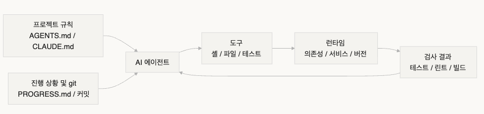
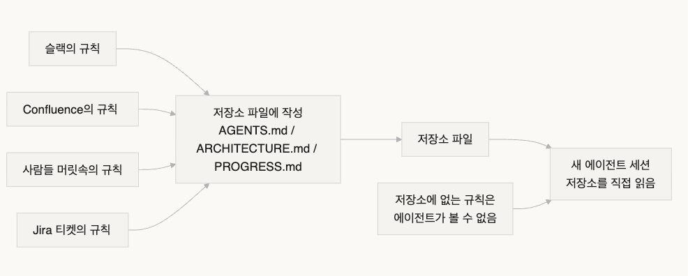

# Week 01 학습 정리

- Chapter 1. 강력한 모델도 실행 신뢰성을 보장하지 않는다
- Chapter 2. 하네스란 실제로 무엇인가
- Chapter 3. 저장소를 단일 진실 원천으로 만들어라

## 핵심 용어

- **하네스(Harness) : 모델 외부의 모든 것 — 지시사항, 도구, 환경, 상태(state) 관리, 검증(verification) 피드백**
- **진단 루프(Diagnostic Loop)**: 실행 → 실패 관찰 → 특정 하네스 레이어에 귀속 → 해당 레이어 수정 → 재실행.
- **완료 기준(Definition of Done)**: 테스트 통과, 린트 클린, 타입 검사 통과.
- **콜드 스타트 테스트(Cold-Start Test): 저장소 품질을 평가하는 다섯 가지 질문**

---

## 핵심 개념

- **지도를 줘라, 매뉴얼이 아니라**:
  - `AGENTS.md`는 백과사전이 아니라 디렉터리 페이지이다, 100줄 정도
  - 맞지 않으면 `docs/` 디렉터리로 분리하여 에이전트가 필요할 때 읽도록 한다
- **제약하되, 마이크로매니지하지 마라:**
  - 지시를 하나하나 열거하지 않는다.
  - 해결책은 "일하는 사람"과 "확인하는 사람"을 분리하는 것
- **컴포넌트를 하나씩 제거:**
  - 각 하네스 컴포넌트의 한계 기여도를 정량화하려면 하나씩 제거하고 어떤 제거가 가장 큰 성능 저하를 유발하는지 확인

---

## 핵심 내용 요약

### Chapter 1 : 강력한 모델도 실행 신뢰성을 보장하지 않는다

- **에이전트가 실제로 막히는 지점**
  1. 작업을 명확하게 정의하지 않음
     - ex) "검색 기능을 추가해”
     - 무엇을 검색? 전문 검색 아니면 구조화 검색? 페이지네이션은? 하이라이팅 은? 명시하지 않았으니 에이전트는 추측
  2. 암묵적 아키텍처 컨벤션
     - 팀에서는 SQLAlchemy 2.0 문법을 표준으로 쓰는데 에이전트 는 기본적으로 1.x 코드를 작성
     - 모든 API 엔드포인트는 OAuth 2.0 인증을 사용
  3. 불완전한 개발 환경, 의존성 누락, 잘못된 도구 버전
     - 컨텍스트 윈도 낭비
       - `pip install` 실패와 Node 버전 불일치
  4. 검증 방법 미존재
     - 테스트, 린트, 검증 명령어
     - 에이전트가 컨텍스트 부족을 감지하면 검증을 건너뛰고, 최선 대신 단순한 해결책을 선택 = “컨텍스트 불안”
       - 시험 시간이 거의 다 됐을 때 남은 객관식 문제를 무작위로 찍는 것과 같은 현상
     - 명시적 검증 명령어 예시) `pytest tests/api/v2/ && python -m mypy src/`
  5. 세션에 걸친 장시간 작업
     - 매 새 세션마다 프로젝트 구조 재탐색 및 코드 구성 재이해
       - 영속적 상태 (state)가 필요하다
- **실패하면 먼저 하네스를 점검하라**
  1. **모든 실패를 특정 레이어에 귀속**
     1. 작업이 불명확했는가? 컨텍스트(context)가 불충분했는가? 검증 방법이 없었는가?
     2. 각 실패를 다섯 가지 실패 레이어(작업 명세, 컨텍스트 제공, 실행 환경, 검증 피드백, 상태 관리) 중 하나에 매핑

     ```sql
     완료 기준:
     - 새 엔드포인트 GET /api/search?q=xxx
     - 페이지네이션 지원, 기본 20개 항목
     - 결과에 하이라이트된 스니펫 포함
     - 모든 새 코드가 pytest 통과
     - 타입 검사 통과 (mypy --strict)
     ```

  2. **AGENTS.md 파일**
     1. 저장소 루트에 배치 (프로젝트의 기술 스택, 아키텍처 컨벤션, 검증 명령어)
     2. 파일 하나가 더 비싼 모델로 업그레이드하는 것보다 효과적
  3. **진단 루프를 구축**
     1. 같은 방식으로 다시 실패하지 않도록 매 실패마다 레이어를 찾아 수정
  4. **개선 사항을 정량화**
     1. 간단한 로그를 유지
        1. 성공, 실패, 어느 레이어가 실패

---

### Chapter 2 : 하네스란 실제로 무엇인가

- **비유로 시작하기**
  - 갑자기 투입된 신규 엔지니어 - "이 프로젝트가 뭔지 파악하는 것"에 엄청난 시간을 투자
  - OpenAI 핵심 원칙
    - "저장소(repo)가 명세(spec)다”
    - 필요한 모든 컨텍스트(context)
      - 구조화된 지시 파일
      - 명시적 검증(verification) 명령어
      - 명확한 디렉터리 구성
  - 코딩 에이전트 도구
    - **Codex**
      - 로컬 관측성 스택(로그, 메트릭, 트레이스)과 결합하여 모든 변경 사항이 독립적인 환경에서 검증
- **5개 하위 시스템 하네스 모델**
  
  1. **지시 하위 시스템 :** AGENTS.md
     프로젝트 개요와 목적(한 문장), 기술 스택과 버전(Python 3.11, FastAPI 0.100+, PostgreSQL 15), 첫 실행 명령어(`make setup`, `make test`), 협상 불가능한 HARD 제약("모든 API는 OAuth 2.0을 사용해야 함")
  1. **도구 하위 시스템**
     1. 에이전트가 충분한 도구 접근권을 가지지만, 최소 권한 원칙을 따른다.
  1. **환경 하위 시스템**
     1. 의존성 잠금 - `pyproject.toml` 또는 `package.json`
     2. 런타임 버전 - `.nvmrc` 또는 `.python-version`
     3. 재현성 - Docker 또는 devcontainers
  1. **상태(state) 하위 시스템**
     1. 장시간 작업 진행 추적- `PROGRESS.md`
        1. 완료된 것, 진행 중인 것, 차단된 것. 매 세션 종료 전에 업데이트하고, 다음 세션 시작 시 읽으십시오. 
  1. **피드백 하위 시스템**
     1. `AGENTS.md`에 검증 명령어를 명시적으로 나열

     ```sql
     검증 명령어:
     - 테스트: pytest tests/ -x
     - 타입 검사: mypy src/ --strict
     - 린트: ruff check src/
     - 전체 검증: make check (위 모두 포함)
     ```

  1. **하네스 컴포넌트 가치 정량화**
     1. 같은 모델을 고정한 컴포넌트 제거 실험
        1. 모델을 고정하고 하위 시스템을 하나씩 제거하면서 어떤 제거가 가장 큰 성능 저하를 유발하는지 측정
        2. 큰 하락 - 병목일 수 있음을 의심
        3. 작은 하락 - 중복, 설계, 충분히 사용되지 않음을 의심
     2. 병목 진단
        1. 실패 기록과 귀인을 사용
        2. 실패 원인이 불명확한 작업 의도, 부족한 컨텍스트, 재현 불가능한 환경, 검증 피드백 부재, 끊긴 상태 관리 중 무엇인지 확인

---

### Chapter 3 : 저장소를 단일 진실 원천으로 만들어라

- **지도에 무엇이 있어야 하는가**
  - 세션 간 영속적 상태(state) 복구 가능성
    - 작업 성공률 결정
    - 저장소에 존재 (`src/api/` 50줄짜리 `ARCHITECTURE.md` )
  - 에이전트는 사람에게 물어볼 수 없습니다. 알아야 하는 모든 것은 적어서 찾을 수 있는 곳에 두어야 합니다.
- **지식 가시성**
  
  지도가 충분히 좋은지 테스트하는 방법은?
  "콜드 스타트 테스트(cold-start test)"를 실행
  다섯 가지 기본 질문에 답할 수 있는지 확인
  
  **지도에 빈 곳이 있으면 에이전트는 추측합니다 — 잘못된 추측은 버그가 되고, 과도한 추측은 컨텍스트(context)를 낭비합니다. 그리고 모든 새 세션에서 다시 추측합니다. 추측의 비용은 항상 처음부터 제대로 지도를 그리는 비용보다 높습니다.**
- **좋은 지도를 그리는 법**
  - **원칙 1: 지식은 코드 옆**
    - API 엔드포인트 인증에 관한 규칙은 API 코드 옆
    - 도서관 선반 레이블 처럼, 각 모듈 디렉터리에 해당 모듈의 책임, 인터페이스, 특별 제약을 설명하는 짧은 문서를 둔다.
  - **원칙 2: 표준화된 진입 파일**
    - `AGENTS.md` = 에이전트의 "랜딩 페이지”
    - "이 프로젝트가 무엇인가", "어떻게 실행하는가", "어떻게 검증하는가". 50-100줄이면 충분
  - **원칙 3: 최소하되 완전하게**
    - 명확한 사용 사례
      - 규칙을 제거해도 에이전트의 결정 품질에 영향을 주지 않는다면 그 규칙은 존재하지 않아야 한다.
      - 하지만 콜드 스타트 테스트의 모든 질문에는 답이 있어야 한다.
  - **원칙 4: 코드와 함께 업데이트**
    - 지식 업데이트를 코드 변경에 바인딩
      - 가장 간단한 방법: 아키텍처 문서를 해당 모듈 디렉터리에 두어 코드 변경 후 CI에서 문서 업데이트가 필요한지 확인하도록 한다.
  - **구체적인 저장소 구조**:
  ```sql
  project/
  ├── AGENTS.md              # 진입점: 프로젝트 개요, 실행 명령어, HARD 제약
  ├── src/
  │   ├── api/
  │   │   ├── ARCHITECTURE.md  # API 레이어 아키텍처 결정
  │   │   └── ...
  │   ├── db/
  │   │   ├── CONSTRAINTS.md   # 데이터베이스 작업 HARD 제약
  │   │   └── ...
  │   └── ...
  ├── PROGRESS.md             # 현재 진행 상황: 완료, 진행 중, 차단됨
  └── Makefile                # 표준화된 명령어: setup, test, lint, check
  ```
- **ACID 원칙으로 에이전트 상태 관리하기**
  - **원자성(Atomicity) - 전부 아니면 아무것도**
    - 하나의 논리적 작업이 하나의 git 커밋을 받는다
    - 중간에 실패하면 `git stash`로 롤백
  - **일관성(Consistency) -입금 없이 출금할 수 없습니다.**
    - "일관된 상태" 검증 조건이 존재
      - 모든 테스트 통과, 린트 오류 없음.
  - **격리성(Isolation) - 동시에 간을 맞출 수 없다 (책임자는?)**
    - 여러 에이전트가 동시에 작업할 때 상태 파일이 경쟁 조건을 피하도록 설계
    - 간단한 방법: 각 에이전트가 자체 진행 파일을 사용하거나, 격리를 위해 git 브랜치를 사용
  - **내구성(Durability) - 종이에 있는 것만 인정**
    - 중요한 프로젝트 지식은 git으로 추적되는 파일에
    - 세션 간 지식은 파일에 영속화

---

## 인상 깊었던 내용

- 백만 줄 코드 실험 (OpenAI 2025 공격적 실험)
  - 핵심 제약: **인간은 코드를 직접 작성하지 않습니다.**
    - **엔지니어의 주요 업무 : 환경 설계, 의도 표현, 피드백 루프 구축**
  - 목표 : Codex를 사용하여 빈 git 저장소에서 완전한 내부 제품을 구축
    - 5개월 후 저장소에는 약 100만 줄의 코드가 생성
    - 애플리케이션 로직, 인프라, 툴링, 문서, 내부 개발 도구 모두 에이전트가 생성
    - 세 명의 엔지니어가 Codex를 운영하며 약 1,500개의 PR을 열고 병합
    - 1인당 하루 평균 3.5개의 PR
  - 과정
    - 초기 진행은 느렸음 환경이 아직 충분히 갖춰지지 않았기 때문
    - 해결 : 큰 목표를 작은 구성 요소(설계, 코드, 리뷰, 테스트)로 분해하고, 에이전트가 조합하도록 한 다음, 그 구성 요소들을 활용하여 더 복잡한 작업을 가능하게 함
  - 배울 점
    - "에이전트에게 어떤 역량이 부족하고, 어떻게 하면 이해 가능하고 실행 가능하게 만들 수 있는가?”

- 하네스는 코드처럼 부패합니다. 정기적으로 감사하고 기술 부채를 갚듯 하네스 부채를 갚으십시오.
- 지식 부패가 가장 큰 적입니다. 코드와 동기화되지 않는 문서는 문서가 없는 것보다 더 위험합니다 — 에이전트를 맞는 방향이라고 생각하면서 잘못된 방향으로 보냅니다.

- 실제 변환 사례
  1. 저장소 루트에 `AGENTS.md`를 만들어 프로젝트 개요, 기술 스택 버전, 전역 HARD 제약 포함
  2. 각 마이크로서비스 디렉터리에 책임, 인터페이스, 의존성을 설명하는 `ARCHITECTURE.md` 추가
  3. 명시적인 "MUST/MUST NOT" 언어로 HARD 제약을 담은 중앙 집중식 `CONSTRAINTS.md` 생성
  4. 각 서비스 디렉터리에 현재 작업 상태를 추적하는 `PROGRESS.md` 추가

---

## 이해가 어려웠던 내용

지식 외재화나 하네스 컴포넌트의 가치를 실험을 통해 정량화하는 경험이 없어, 해당 내용이 실제로 어떻게 측정되고 활용되는지 쉽게 와닿지 않았다.

## 추가로 찾아본 내용

...

## 스터디에서 이야기해보고 싶은 점

직접 하네스 엔지니어링 또는 유사한 작업을 해보신 적이 있는지 궁금합니다!
