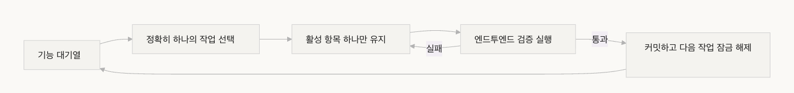
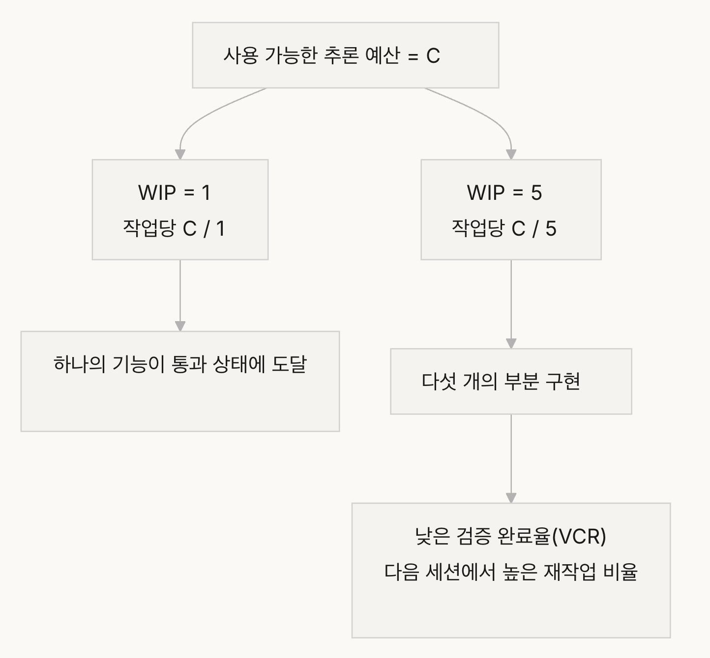
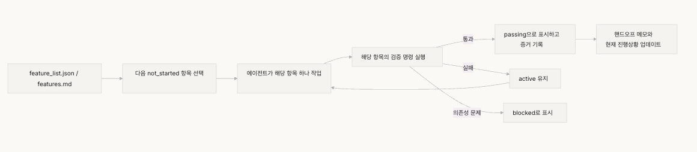
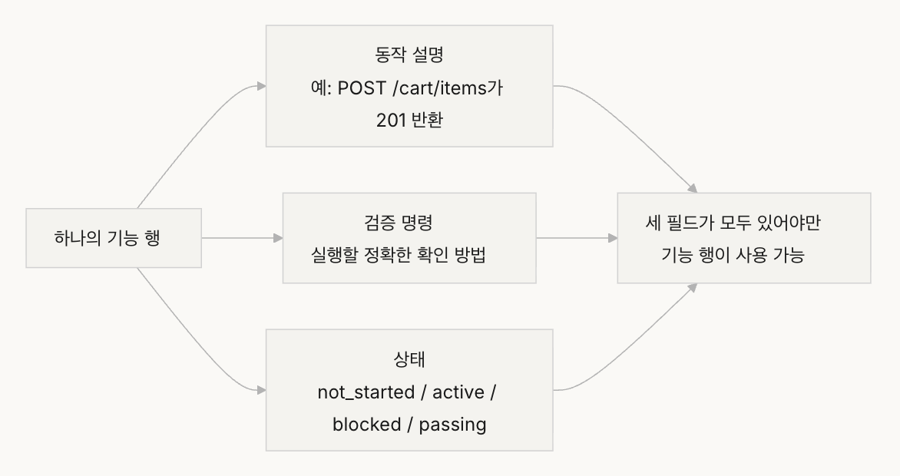
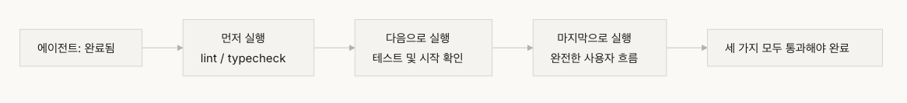

# 강의 07. 에이전트에게 명확한 작업 경계를 그어 주어야 합니다

## 작업 경계가 필요한 이유

- 수정된 파일은 많아지고, 새 코드도 많아지지만 **실제로 동작하는 기능은 없을 수 있다.**
- 에이전트는 **"조금 더 해두자"**는 성향이 있어 관련 작업을 계속 확장한다.
- **프롬프트가 지나치게 넓으면** 한 가지를 끝내기보다 여러 가지를 동시에 시작한다.
- **명시적인 작업 범위가 없으면 작업 효율이 급격히 감소한다.**
- 문제는 모델이 아니라 **하네스(Harness)가 작업 경계를 만들어주지 않은 것**이다.

---

## 주의력은 유한한 자원

- 에이전트의 Context를 **C**, 동시에 수행하는 작업 수를 **K**라고 하면,
  - 각 작업에는 평균 **C / K** 만큼의 추론 자원이 할당된다.
- **C / K가 임계값 아래로 떨어지면 어떤 작업도 완성되지 않는다.**
- 하나의 기능 요청도 여러 작업으로 확장될 수 있다.
- **엔드투엔드 검증이 없으면 다음 세션은 방향을 잃는다.**
- **작은 다음 단계(Small Next Step, WIP=1)** 전략을 사용한 에이전트는 **작업 완료율이 37% 더 높았다.**

---

# 핵심 개념

## Overreach (과욕)

- 한 세션에서 최적보다 많은 작업을 동시에 활성화하는 것.

## Under-finish (미완성)

- 활성화한 작업 중 엔드투엔드 검증을 통과한 작업의 비율이 너무 낮은 상태.

## WIP 제한 (Work-in-Progress Limit)

- 동시에 진행 중인 작업 수를 제한한다.
- **에이전트는 WIP=1이 가장 안전한 기본값이다.**
- **하나를 끝낸 후 다음 작업을 시작한다.**

## Completion Evidence (완료 증거)

- 완료는 **"코드를 작성했다"**가 아니라 **"동작이 검증되었다"**이다.

## Scope Surface

- 작업 상태를 **기계가 읽을 수 있는 파일(JSON/Markdown)** 로 기록한다.
- 작업 상태 예시
  - not_started
  - active
  - blocked
  - passing

## Completion Pressure

- WIP 제한과 완료 증거를 이용하여 **현재 작업을 끝내기 전에는 새로운 작업을 시작하지 않도록 한다.**

---

# 과욕과 미완성

- **과욕과 미완성은 서로를 증폭시키는 관계이다.**
- WIP가 높을수록 시작부터 검증 완료까지의 시간이 길어지고 실패 확률도 증가한다.
- 범위 크립(scope creep)는 프로젝트 실패의 주요 원인이다.
- **에이전트는 아이디어를 추가하는 비용이 거의 없어 계속 범위를 넓히려는 경향이 있다.**

---

# wip = 1 워크플로우




# 올바른 방법

## 1. WIP=1 강제 적용

- 한 번에 하나의 기능만 작업한다.
- 현재 기능이 **엔드투엔드 검증을 통과한 후에만** 다음 기능을 시작한다.
- 구현 중 다른 기능을 리팩터링하지 않는다.

```md
## 작업 규칙

- 한 번에 하나의 기능만 작업합니다
- 현재 기능이 엔드투엔드 검증을 통과한 후에만 다음 기능을 시작합니다
- 기능 A를 구현하는 동안 기능 B도 "리팩터링"하지 않습니다
```

## 2. 모든 작업에 완료 증거 정의

- 완료 기준은 **동작 검증 통과**이다.
- 기능 목록의 모든 항목에는 **검증 명령**이 존재해야 한다.

```md
F01: 사용자 등록
검증: curl -X POST /api/register -d '{"email":"test@example.com","password":"123456"}' | jq .status == 201
상태: passing
```

## 3. 범위 표면 외부화

- 작업 상태를 **JSON 또는 Markdown**으로 관리한다.
- 새로운 세션도 파일만 읽으면
  - 현재 활성 작업
  - 완료 기준
  - 검증 결과
    를 즉시 이해할 수 있어야 한다.

## 4. 검증 완료율(VCR) 모니터링

- **VCR = 검증된 작업 / 활성화된 작업**
- **VCR < 1.0이면 새로운 작업을 시작하지 않는다.**

---

# 실제 사례

## 제한 없이 작업

- 5개의 기능을 동시에 활성화
- 약 **800줄 코드**
- **엔드투엔드 테스트 통과율 20%**
- 세션 종료 시 **8개 기능 중 3개 완료**

## WIP=1 적용

- 사용자 등록 하나만 구현
- 약 **200줄 코드**
- **엔드투엔드 테스트 100% 통과**
- 세션 종료 시 **8개 기능 중 7개 완료**

### 결과

- **800줄 vs 200줄**
- **완료율 37.5% vs 87.5%**
- **적게 작성했지만 더 많은 기능을 완성했다.**

---

# 핵심 요점

- **WIP=1은 에이전트 하네스의 기본 안전 설정이다.**
- 완료 증거는 **실행 가능한 검증**이어야 한다.
- 범위는 **파일로 외부화**해야 한다.
- **과욕과 미완성은 공생 관계**이다.
- **"적게 하되 끝내는 것"이 "많이 하되 반만 남기는 것"보다 낫다.**
- **품질이 항상 양을 이긴다.**

---

# 연습 문제

## 1. 작업 원자화

- 넓은 요구사항을 최소 5개의 원자 작업으로 분해한다.
- 각 작업마다
  - 작업 설명
  - 실행 가능한 검증 명령
  - 의존성
    을 정의한다.
- WIP=1 제약을 만족하는지 확인한다.

## 2. 비교 실험

- 같은 프로젝트를
  - 제약 없이
  - WIP=1 적용
    두 방식으로 수행한다.
- 비교 항목
  - 검증 완료율
  - 총 코드량
  - 유효 코드 비율

## 3. 완료 증거 감사

- 최근 작업을
  - 완료된 동작
  - 미완성 동작
  - 스캐폴딩
    으로 분류한다.
- 미완성 작업에는 **검증 명령을 추가한다.**

# 강의 08. 기능 목록으로 에이전트의 행동을 제약하십시오

## 왜 기능 목록이 필요한가

- **"완료"의 기준을 알려주지 않으면 에이전트는 자신의 기준으로 완료를 판단한다.**
- 기능 목록(Feature List)은 단순한 메모가 아니라 **하네스의 근간(backbone)** 이다.
- **스케줄러**는 기능 목록으로 다음 작업을 선택한다.
- **검증기(Verifier)** 는 기능 목록으로 완료 여부를 판단한다.
- **핸드오프(Handoff)** 보고기도 기능 목록을 기반으로 요약을 생성한다.
- **산출물(Artifact)은 외부화되어야 하며**, 기능 상태는 **저장소의 기계가 읽을 수 있는 파일**에 존재해야 한다.

---

# 에이전트는 "완료"의 의미를 모른다

- 모델은 **"Cart 컴포넌트 작성"** 을 완료라고 생각할 수 있다.
- 하지만 실제 목표는 **상품 탐색 → 장바구니 → 결제까지 가능한 엔드투엔드 동작**이다.
- 에이전트는 **암묵적인 완료 기준**을 사용한다.
- 필요한 것은 **엔드투엔드 동작 검증**이다.
- 단순 진행 메모만으로는
  - "거의 완료"가 무엇인지
  - 어떤 테스트를 통과했는지
  - 무엇이 남았는지
    를 알 수 없다.
- 좋은 진행 기록은 **세션 시작 진단 시간을 60~80% 단축**한다.

---

# 핵심 개념

## 기능 목록은 하네스 프리미티브(Primitive)

- 기능 목록은 **하네스의 기본 데이터 구조**이다.
- 다른 모든 하네스 구성 요소가 기능 목록을 기반으로 동작한다.

---

## 삼중 구조

모든 기능은 다음 세 가지 정보를 가진다.

- **동작 설명(Behavior)**
- **검증 명령(Verification)**
- **현재 상태(State)**

---

## 상태 기계(State Machine)

기능 상태는 다음 네 가지이다.

- `not_started`
- `active`
- `blocked`
- `passing`




---

## Pass-state Gating

- **active → passing** 으로 이동하는 유일한 방법은
  **검증 명령을 성공적으로 통과하는 것**이다.
- **passing 상태는 되돌릴 수 없다.**

---

## Single Source of Truth

- 프로젝트에서 해야 할 모든 정보는 **기능 목록 하나**에서 파생되어야 한다.
- 기능 목록과 대화 내용 사이에 모순이 있으면 안 된다.

---

## Back-pressure

- 아직 통과하지 못한 기능 수가 에이전트에게 가하는 압력이다.
- 압력이 0이면 프로젝트가 완료된 것이다.

---

# 기능 목록이 프리미티브여야 하는 이유

- 문서는 사람이 읽기 위한 것이고,
- **프리미티브는 시스템이 실행하기 위한 것이다.**
- 문서는 무시될 수 있지만,
- **프리미티브는 우회할 수 없다.**

기능 목록을 기반으로 동작하는 요소

1. **Scheduler**
   - 다음 `not_started` 작업 선택

2. **Verifier**
   - 검증 실행 후 상태 전환 결정

3. **Handoff Reporter**
   - 기능 목록으로 세션 핸드오프 생성

4. **Progress Tracker**
   - 상태 분포 집계 및 프로젝트 지표 생성

---

# 올바른 방법

## 1. 최소한의 기능 목록 형식 정의

- **구조화된 Markdfown 또는 JSON이면 충분하다.**
- 모든 기능은
  - 동작 설명
  - 검증 명령
  - 상태
    를 포함해야 한다.

```md
{
"id": "F03",
"behavior": "POST /cart/items with {product_id, quantity} returns 201",
"verification": "curl -X POST http://localhost:3000/api/cart/items -H 'Content-Type: application/json' -d '{\"product_id\":1,\"quantity\":2}' | jq .status == 201",
"state": "passing",
"evidence": "commit abc123, test output log"
}
```

---

## 2. 상태 전환은 하네스가 제어

- 에이전트는 기능 상태를 **passing**으로 직접 변경할 수 없다.
- 검증 요청만 제출하고,
- 하네스가 검증 후 상태 전환을 허용한다.

---

## 3. CLAUDE.md 규칙 작성

- 기능 목록 파일 위치 정의
- 한 번에 하나의 기능만 활성화
- passing 전에 반드시 검증 통과
- 기능 상태를 직접 수정하지 않음

```md
## 기능 목록 규칙

- 기능 목록 파일: /docs/features.md
- 한 번에 하나의 기능만 활성화
- passing으로 표시하기 전에 검증 명령이 통과해야 함
- 기능 목록 상태를 직접 수정하지 마십시오 — 검증 스크립트가 자동으로 업데이트합니다
```

---

## 4. 세분화 수준 조정

- 하나의 기능은 **한 세션 안에 완료 가능한 크기**여야 한다.
- 너무 크면 완료되지 않고,
- 너무 작으면 관리 비용이 증가한다.

---

# 실제 사례

## 메모 방식

- 구조화되지 않은 메모 사용
- 새 세션은 상태를 추론하는 데 약 **20분** 소요
- 이미 완료된 기능을 다시 구현하기도 함

---

## 구조화된 기능 목록

- 모든 기능이
  - 상태
  - 검증 명령
    을 가진다.
- 새 세션은 기능 목록만 읽고
  **약 3분 안에 작업을 이어갈 수 있다.**

### 결과

- **기능 완료율 45% 향상**
- **중복 구현 0건**

---

# 핵심 요점

- 기능 목록은 **하네스의 근간**이다.
- 모든 기능은
  - 동작 설명
  - 검증 명령
  - 현재 상태
    의 **삼중 구조**를 가져야 한다.
- 상태 전환은 **하네스가 제어**한다.
- 기능 목록은 프로젝트의 **단일 진실 원천(Single Source of Truth)** 이다.
- 기능은 **한 세션 내에 완료 가능한 크기**로 분할한다.

---

# 연습 문제

## 1. 기능 목록 설계

최소한 다음 항목을 포함하는 JSON 스키마를 설계한다.

- id
- 동작 설명
- 검증 명령
- 현재 상태
- 증거 참조

---

## 2. 검증 엄격성 비교

3개의 기능을 선택하여

- 느슨한 검증
- 엄격한 엔드투엔드 검증

두 방식을 설계하고 위양성 비율을 비교한다.

---

## 3. 단일 진실 원천 감사

프로젝트를 점검하여

기능 목록과 모순되는

- 대화 내용
- TODO
- 암묵적인 요구사항

을 찾아 기능 목록으로 통합한다.

# 강의 09. 에이전트가 너무 일찍 완료를 선언하지 못하도록 방지하기

## 왜 조기 완료 선언이 발생하는가

- 에이전트는 **단위 테스트가 통과하면 완료되었다고 판단**하는 경향이 있다.
- 하지만 실제로는
  - 이메일 서비스 설정 누락
  - 데이터베이스 마이그레이션 실패
  - 엔드투엔드 흐름 미검증
    등이 남아 있을 수 있다.
- **에이전트의 "완료 느낌" 대신 실행 기반 검증(Verification)을 사용해야 한다.**

---

# 미끄러운 경사면

조기 완료 선언은 대부분 같은 패턴을 따른다.

- 코드가 보기에는 정상이다.
- 문법 오류도 없다.
- 단위 테스트도 통과한다.
- **하지만 통합 테스트와 엔드투엔드 테스트는 수행하지 않는다.**
- 결국 **"코드가 멀쩡해 보인다"가 완료의 근거**가 된다.

또한

- 정보는 작업 명세 → 코드 구현 → 런타임 실행 과정에서 계속 손실된다.
- **건너뛴 검증이 많을수록 정보 비대칭이 커진다.**

---

# 3단계 종료 검사



---

# 핵심 개념

## Premature Completion Declaration

- 에이전트는 완료를 선언하지만
- 실제 시스템 요구사항은 아직 충족되지 않은 상태.

---

## Confidence Calibration Bias

- 에이전트의 **자체 완료 신뢰도**와
- **실제 품질** 사이에는 체계적인 차이가 있다.
- 복잡한 작업일수록 자신감을 과대평가한다.

---

## 종료 기준(Termination Criteria)

- 완료는 **명확하고 실행 가능한 조건**을 만족해야 한다.
- 완료 판단은 **주관적 판단이 아니라 객관적 기준**이어야 한다.

---

## Verification–Validation Dual Gate

완료로 인정되려면 두 단계를 모두 통과해야 한다.

1. **Verification**
   - 명세대로 구현되었는가?

2. **Validation**
   - 실제 시스템 요구사항을 만족하는가?

---

## Runtime Feedback Signals

완료 판단은 런타임에서 얻는

- 로그
- 프로세스 상태
- 실행 결과

등의 **객관적 신호**를 기반으로 해야 한다.

---

## Completion Priority Constraint

우선순서는 항상

1. 기능 정확성 검증
2. 성능
3. 스타일

순이다.

> **핵심 기능이 검증되기 전에는 리팩터링하지 않는다.**

---

# 단위 테스트 통과 ≠ 작업 완료

단위 테스트는

- 의존성을 모킹한다.
- 컴포넌트를 분리한다.

따라서 실제 시스템 문제를 발견하지 못할 수 있다.

대표 사례

### 인터페이스 불일치

- 모든 단위 테스트는 통과
- 하지만 실제 엔드투엔드에서는 실패

---

### 상태 전파 오류

- DB 마이그레이션 후
- ORM 캐시가 이전 상태를 유지
- 단위 테스트에서는 드러나지 않음

---

### 환경 의존성

테스트 환경에서는 정상

하지만 실제 환경에서는

- 설정 차이
- 네트워크
- 서비스 장애

등으로 실패한다.

---

# "그 김에 리팩터링"은 독이다

핵심 기능 검증 전에

- 리팩터링
- 성능 최적화
- 스타일 수정

을 하면

**검증된 코드와 미검증 코드의 경계가 무너진다.**

---

# 자기 평가의 체계적 편향

Anthropic 연구 결과

- 에이전트에게 자신의 작업을 평가시키면
- 실제 품질보다 **체계적으로 더 긍정적인 평가**를 내린다.

해결 방법

- **작업자와 평가자를 분리한다.**
- 독립적인 평가 에이전트가 검증한다.

같은 모델이어도

- 생성
- 평가

역할을 분리하면 품질이 향상된다.

---

# 조기 제출을 방지하는 방법

## 1. 종료 판단 외부화

완료는 에이전트가 결정하지 않는다.

완료 조건

1. 단위 테스트 통과
2. 통합 테스트 통과
3. 엔드투엔드 검증 통과

하나라도 실패하면 다음 단계로 진행하지 않는다.

```md
## 완료의 정의

- 기능 완료 = 엔드투엔드 검증 통과, "코드가 작성됨"이 아님
- 필요한 검증 레벨:
  1. 단위 테스트 통과
  2. 통합 테스트 통과
  3. 엔드투엔드 흐름 검증 통과
- 레벨 1이 실패하면 레벨 2로 진행하지 않습니다
- 레벨 2가 실패하면 레벨 3으로 진행하지 않습니다
```

---

## 2. 3단계 종료 유효성 검사

### 레이어 1

- 문법 검사
- 정적 분석

---

### 레이어 2

- 런타임 실행
- 앱 시작 확인
- 핵심 경로 실행

---

### 레이어 3

- 엔드투엔드 테스트
- 시스템 수준 확인
- 사용자 시나리오 검증

---

## 3. 좋은 "빨간 펜 수정"

오류 메시지는

단순히

> 테스트 실패

가 아니라

**수정 방법까지 포함**해야 한다.

예시

- 어떤 API가 실패했는지
- 어떤 환경 변수가 없는지
- 어떤 파일을 수정해야 하는지

처럼 **실행 가능한 피드백**을 제공한다.
`"테스트 실패: POST /api/reset-password가 500을 반환했습니다. 환경 변수에 이메일 서비스 설정이 있는지 확인하십시오. 템플릿 파일은 templates/reset-email.html에 있어야 합니다."`

---

## 4. 런타임 신호 수집

완료 전에 반드시 확인

- 애플리케이션이 정상 시작되는가
- 핵심 기능 경로가 실행되는가
- DB/파일 작업이 정상 수행되는가
- 임시 리소스가 정상 정리되는가

---

# 실제 사례

조기 완료 경로

- DB 수정
- API 작성
- 이메일 템플릿 작성
- 단위 테스트 통과
- 완료 선언

실제 문제

- 재설정 링크 검증 안 됨
- DB 마이그레이션 실패
- 이메일 서비스 설정 누락

하네스 개입

- 전체 앱 실행
- 재설정 흐름 실행
- DB 상태 검증

→ 세션 안에서 모든 결함 발견

---

# 핵심 요점

- 에이전트는 **체계적으로 과도한 자신감**을 가진다.
- 완료 판단은 **반드시 외부화**해야 한다.
- 완료는
  1. 문법
  2. 실행
  3. 시스템
     **3단계 검증을 모두 통과해야 한다.**
- 오류 메시지는 **구체적인 수정 방법**까지 포함해야 한다.
- **핵심 기능이 검증되기 전에는 리팩터링하지 않는다.**

---

# 연습 문제

## 1. 종료 유효성 검사 설계

- 필요한 런타임 신호 정의
- 각 신호의 통과/실패 기준 정의
- 실제 실행 후 숨겨진 문제 기록

---

## 2. 보정 편향 측정

10개의 작업을 선택하여

- 에이전트의 자체 완료 신뢰도
- 실제 완료 품질

을 비교하고 편향을 계산한다.

---

## 3. 다층 방어 실험

다음 세 가지를 비교한다.

1. 정적 분석만
2. 단위 테스트 추가
3. 완전한 3단계 종료 유효성 검사

그리고

- 조기 완료 선언 비율
- 발견되지 않은 결함 수

를 비교한다.
