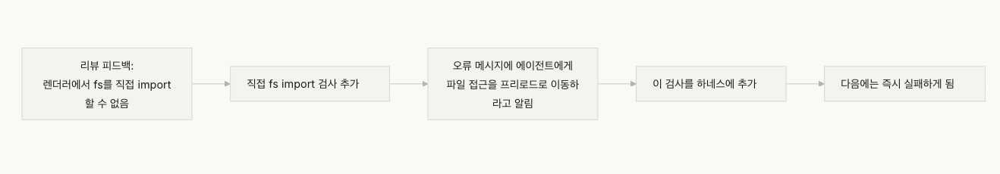

# 강의 10. 엔드투엔드 테스트(E2E)만이 진정한 검증이다

## 왜 단위 테스트만으로는 부족한가

단위 테스트(Unit Test)는 각 컴포넌트가 **개별적으로 올바르게 동작하는지** 확인한다.

하지만 실제 시스템은 여러 컴포넌트가 함께 동작한다.

각 부분이 모두 정상이어도

> **컴포넌트 간 경계(Component Boundary)** 에서 발생하는 문제는 단위 테스트가 발견하지 못한다.

엔드투엔드 테스트(E2E)는 이러한 **시스템 수준의 결함**을 검증하는 유일한 방법이다.

---

# 단위 테스트의 맹점

단위 테스트는 **격리(Isolation)** 를 전제로 한다.

하지만 실제 환경에서는 다음과 같은 문제가 발생한다.

### 인터페이스 불일치

각 컴포넌트는 올바르게 동작하지만

컴포넌트 간 인터페이스가 맞지 않아 전체 시스템이 실패한다.

---

### 상태 전파 오류

각 계층은 정상이어도

상태(State)가 다른 계층으로 올바르게 전달되지 않을 수 있다.

---

### 리소스 수명 주기 문제

실제 환경에서는

- 파일 핸들
- 데이터베이스 연결
- 네트워크 소켓

등의 자원이 여러 컴포넌트를 거치며 관리된다.

단위 테스트는 이러한 자원 관리 문제를 발견하기 어렵다.

---

### 환경 의존성

모의(Mock) 환경에서는 정상이어도

실제 실행 환경에서는

- 설정 차이
- 네트워크
- 서비스 상태

등으로 인해 실패할 수 있다.

---

# 엔드투엔드 테스트가 만드는 변화

엔드투엔드 테스트는 단순히 **결함을 찾는 도구가 아니다.**

개발자의 구현 방식 자체를 바꾼다.

### 1. 컴포넌트 간 상호작용을 먼저 고려한다.

단순히 함수 하나를 구현하는 것이 아니라

> "이 인터페이스가 다른 컴포넌트와 어떻게 연결되는가"

를 먼저 생각하게 된다.

---

### 2. 아키텍처 규칙을 자연스럽게 지키게 된다.

엔드투엔드 테스트는

아키텍처 제약을 실제 실행 과정에서 검증한다.

따라서 구조를 무시한 구현은 자연스럽게 실패한다.

---

### 3. 오류 처리를 적극적으로 설계한다.

실패 시나리오까지 포함하여 테스트하기 때문에

예외 처리와 복구 로직을 처음부터 고려하게 된다.

---

# 테스팅 피라미드



# 리뷰 피드백 승격


---

# 테스트는 리뷰보다 강력한 피드백이다

에이전트를 위한 리뷰는

단순한 문장이 아니라

**자동으로 실행되는 검증**이어야 한다.

예를 들어

> "Renderer에서 직접 파일 시스템 접근 금지"

라고 적는 것이 아니라

이를 자동으로 검사하는 테스트를 만들어야 한다.

문서를 읽는 것보다

실패하는 테스트가 훨씬 강력한 피드백이 된다.

---

# 핵심 개념

## 컴포넌트 경계 결함

단위 테스트는 통과하지만

컴포넌트 사이의 상호작용 때문에 발생하는 결함.

---

## 테스트 적합성 기울기

결함을 발견하는 능력은

단위 테스트 → 통합 테스트 → 엔드투엔드 테스트

순으로 증가한다.

---

## 아키텍처 경계 강제

아키텍처 규칙은

문서가 아니라

자동으로 실행되는 검사로 강제해야 한다.

---

## 리뷰 피드백 승격

반복해서 지적되는 리뷰 내용은

자동 테스트로 승격시켜

다음부터는 사람이 아니라 시스템이 검증하도록 만든다.

---

## 에이전트 지향 오류 메시지

오류 메시지는

단순히 무엇이 틀렸는지를 알려주는 것이 아니라

- 무엇이 잘못되었는지
- 왜 잘못되었는지
- 어떻게 수정해야 하는지

까지 포함해야 한다.

---

# 어떻게 해야 하는가

## 1. 아키텍처를 먼저 정의한다.

엔드투엔드 테스트보다 먼저

시스템의 아키텍처 경계를 명확히 정의한다.

OpenAI는

Layered Domain Architecture를 권장한다.

```
Types
→ Config
→ Repository
→ Service
→ Runtime
→ UI
```

의존성은 한 방향으로만 흐르도록 설계한다.

---

## 2. 하네스에 엔드투엔드 계층을 포함한다.

검증 단계는 명확하게 나눈다.

- Level 1 : 단위 테스트
- Level 2 : 통합 테스트
- Level 3 : 엔드투엔드 테스트

특히 **컴포넌트 경계를 변경하는 작업은 E2E 테스트 통과가 완료 조건**이다.

```md
## 검증 계층 구조

- 레벨 1: 단위 테스트 (반드시 통과)
- 레벨 2: 통합 테스트 (반드시 통과)
- 레벨 3: 엔드투엔드 테스트 (크로스 컴포넌트 변경 시 반드시 통과)
- 필수 레벨 건너뛰기 = 완료 아님
```

---

## 3. 아키텍처 규칙을 자동 검사로 만든다.

아키텍처 규칙은

문서가 아니라

실행 가능한 검사(Test 또는 Lint Rule)로 구현해야 한다.

```md
# 렌더 프로세스가 Node.js API를 직접 호출하는지 검사

grep -r "require('fs')" src/renderer/ && exit 1 || echo "OK: no direct fs access in renderer"
```

---

## 4. 에이전트 지향 오류 메시지를 만든다.

좋은 오류 메시지는 항상

- ERROR
- WHY
- FIX

세 가지 정보를 포함한다.

즉,

> 무엇이 문제인지,
> 왜 문제인지,
> 어떻게 해결하는지를 모두 알려줘야 한다.

```md
ERROR: Found direct import of 'fs' in src/renderer/App.tsx:12
WHY: Renderer process has no access to Node.js APIs for security
FIX: Move file operations to src/preload/file-ops.ts and call via window.api.readFile()
```

---

## 5. 리뷰 피드백을 자동화한다.

반복되는 코드 리뷰는

자동 검사로 승격시킨다.

새로운 유형의 오류가 발견될 때마다

하네스가 점점 더 강력해진다.

---

# 실제 사례

Electron 파일 내보내기 기능에서는

각 컴포넌트의 단위 테스트는 모두 통과했다.

하지만 엔드투엔드 테스트에서는

- 인터페이스 불일치
- 상태 전파 오류
- 리소스 누수
- 권한 문제
- 오류 전파 실패

등 **5개의 결함**을 발견했다.

단위 테스트는 하나도 발견하지 못했다.

테스트 시간은 늘어났지만

전체 시스템의 신뢰성은 크게 향상되었다.

---

# 핵심 정리

- 단위 테스트는 **컴포넌트 경계 결함**을 발견하지 못한다.
- 엔드투엔드 테스트는 **결함뿐 아니라 개발자의 구현 방식까지 바꾼다.**
- 아키텍처 규칙은 문서가 아니라 **자동으로 실행되는 검사**여야 한다.
- 오류 메시지는 **무엇이 문제인지 + 왜 문제인지 + 어떻게 수정하는지**를 포함해야 한다.
- 반복되는 리뷰는 **자동 테스트로 승격**하여 하네스를 지속적으로 강화한다.

# 강의 11. 에이전트의 런타임을 관측 가능하게 만들어라

## 왜 관측 가능성이 필요한가

에이전트에게 기능 구현을 맡기면 종종 이런 상황이 발생한다.

> "구현은 끝났지만 테스트 두 개가 실패합니다."

왜 실패했는지 물으면

> "타이밍 문제인 것 같습니다."

어떤 코드가 문제인지 물으면

> "코드를 다시 살펴보겠습니다."

이 문제는 에이전트의 능력이 부족해서가 아니다.

**하네스가 충분한 관측 가능성(Observability)을 제공하지 못하기 때문**이다.

관측 가능성이 없으면

- 무엇이 실행되었는지 알 수 없고
- 왜 실패했는지 설명할 수 없으며
- 다음 시도를 어떻게 해야 할지도 결정할 수 없다.

결국 모든 수정은 추측이 된다.

---

# 관측 가능성이란

관측 가능성이란

에이전트가 수행한 작업을

**증거(Evidence)** 로 남기는 것이다.

즉,

- 시스템이 무엇을 했는지
- 왜 그렇게 판단했는지

모두 추적할 수 있어야 한다.

---

# 두 가지 관측 가능성

## 1. 런타임 관측 가능성 (Runtime Observability)

실행 중 시스템이 실제로 무엇을 했는지 기록한다.

예시

- 로그(Log)
- Trace
- 상태(State)
- 프로세스 이벤트
- 오류 정보

질문으로 표현하면

> **"시스템이 실제로 무엇을 했는가?"**

에 대한 답이다.

---

## 2. 프로세스 관측 가능성 (Process Observability)

결정 과정 자체를 기록한다.

대표적인 예

- Sprint Contract
- 평가 기준(Rubric)
- 인수 기준(Acceptance Criteria)

질문으로 표현하면

> **"왜 이런 구현을 선택했는가?"**

에 대한 답이다.

---

# 관측 가능성이 없으면 발생하는 문제

## 1. 맞는 코드와 맞아 보이는 코드를 구분할 수 없다.

코드는 완벽해 보인다.

하지만

실제로 실행하면 특정 입력에서 실패한다.

이 차이는

런타임 Trace가 있어야만 발견할 수 있다.

---

## 2. 평가가 주관적이 된다.

채점 기준이 없으면

사람마다

또는 에이전트마다

품질 판단이 달라진다.

동일한 결과물도

누군가는 통과,

누군가는 실패를 줄 수 있다.

---

## 3. 재시도가 추측이 된다.

왜 실패했는지 모르면

다음 수정도 추측이다.

관련 없는 코드를 계속 수정하면서

시간과 토큰만 낭비한다.

---

## 4. 세션 인계 비용이 커진다.

새로운 에이전트는

현재 프로젝트 상태를 다시 분석해야 한다.

관측 가능성이 없으면

매번 처음부터 프로젝트를 이해해야 한다.

결국

세션 시간이 상당 부분

재진단에 사용된다.

---

# 실제 사례

## 관측 가능성이 없는 경우

Planner

↓

모호한 계획

↓

Generator

↓

암묵적인 기준으로 구현

↓

Evaluator

↓

"마음에 안 듭니다."

↓

Generator

↓

다시 수정

↓

또 거절

이 과정이 여러 번 반복된다.

약 45분이 걸리고

겨우 사용할 수 있는 결과가 나온다.

---

## 관측 가능성이 있는 경우

Planner가 먼저

Sprint Contract를 작성한다.

Generator는

계약대로 구현한다.

Runtime Trace는

모든 실행 과정을 기록한다.

Evaluator는

Rubric을 기준으로 평가한다.

결과

한 번의 수정으로

약 15분 만에 완료된다.

---

# 에이전트가 스스로 해결하지 못하는 이유

에이전트에게

"로그를 잘 남겨."

라고 말하는 것만으로는 부족하다.

이유는

- 무엇을 기록해야 하는지 스스로 알지 못하고
- 세션마다 로그 형식이 달라지며
- 결정 과정은 로그만으로 남길 수 없기 때문이다.

따라서

**관측 가능성은 에이전트가 아니라 하네스가 제공해야 한다.**

---

# 올바른 관측 가능성 구축 방법

## 1. 런타임 신호를 자동으로 수집한다.

하네스가 자동으로 기록해야 하는 정보

- 애플리케이션 시작과 종료
- 기능 실행 경로
- 데이터 흐름
- 리소스 사용량
- 오류와 예외 정보

---

## 2. Sprint Contract 작성

작업 시작 전에

반드시 정의한다.

### 포함해야 할 내용

#### 범위(Scope)

무엇을 수정하는가

#### 검증 기준

무엇을 통과해야 하는가

#### 제외 사항

무엇은 이번 작업에 포함하지 않는가

Sprint Contract는

Generator와 Evaluator의 기준을

미리 맞춰 주는 역할을 한다.

---

## 3. Evaluator Rubric 작성

평가를

감각이 아닌

점수로 바꾼다.

대표 평가 항목

- 코드 정확성
- 아키텍처 준수
- 테스트 커버리지

동일한 결과는

누가 평가해도

비슷한 점수를 받아야 한다.

---

## 4. Trace 표준화

각 작업마다

- Trace
- Span
- Validation Span

을 남긴다.

이렇게 하면

실패 원인을

빠르게 추적할 수 있다.

---

# 핵심 개념

## Runtime Observability

시스템이 실제로 수행한 모든 실행 기록

---

## Process Observability

의사결정 과정을 설명하는 기록

---

## Task Trace

작업 시작부터 완료까지의

전체 실행 경로

---

## Sprint Contract

작업 전에 정의하는

범위와 검증 기준

---

## Evaluator Rubric

평가를

객관적인 기준으로 만드는 문서

---

## Layered Observability

런타임과 프로세스

두 계층을 함께 설계하는 것

---

# 핵심 정리

- 관측 가능성은 나중에 붙이는 기능이 아니라 하네스의 핵심 구조이다.
- Runtime Observability는 **무슨 일이 일어났는지**를 설명한다.
- Process Observability는 **왜 그렇게 했는지**를 설명한다.
- Sprint Contract는 구현 전에 생성자와 평가자의 기준을 맞춘다.
- Rubric은 평가를 주관이 아닌 객관적인 점수로 만든다.
- 관측 가능성이 부족하면 실패 원인을 찾지 못하고 같은 문제를 반복한다.
- 충분한 관측 가능성은 디버깅 시간을 줄이고, 세션 간 인계 비용을 줄이며, 개발 효율을 크게 높인다.

---

# 실습 과제

## 1. 관측 가능성 점검

현재 프로젝트의

- Runtime Observability
- Process Observability

를 각각 점검한다.

현재 시스템에서 확인할 수 없는 정보가 무엇인지 찾고,

추가해야 할 관측 신호를 설계한다.

---

## 2. Sprint Contract 작성

실제 기능 하나를 선택하여

Sprint Contract를 작성한다.

이후

- 계약 없이 진행한 경우
- 계약을 작성한 경우

를 비교하여

품질과 효율의 차이를 분석한다.

---

## 3. Task Trace 구성

하나의 기능 개발 과정을

처음부터 끝까지 Trace로 기록한다.

각 단계에서

- 어떤 정보가 남았는지
- 어떤 정보가 부족했는지

분석하고,

병목이 발생하는 구간을 찾아 개선 방안을 제시한다.

# 강의 12. 모든 세션은 클린 상태(Clean State)로 끝나야 한다

## 왜 클린 상태로 종료해야 하는가

에이전트가 하루 동안 작업을 마치고 세션을 종료했다고 가정해 보자.

하지만 저장소에는

- 빌드가 깨져 있고
- 테스트가 실패하며
- 디버그 코드가 남아 있고
- 기능 목록은 갱신되지 않았고
- 현재 진행 상황도 기록되어 있지 않다.

새로운 세션이 시작되면

새로운 기능을 개발하기 전에

먼저

> **"지난 세션이 무엇을 했는가?"**

부터 조사해야 한다.

즉,

다음 세션은 개발이 아니라 복구부터 시작하게 된다.

---

# 클린 상태(Clean State)란

클린 상태란

세션이 종료될 때

다음 세션이 아무런 추가 작업 없이

즉시 개발을 시작할 수 있는 상태를 의미한다.

즉,

세션 종료는

단순히 코드를 작성한 것이 아니라

**다음 세션을 위한 준비까지 완료된 상태**를 의미한다.

---

# 왜 클린 상태가 중요한가

소프트웨어는

아무것도 하지 않아도

복잡도가 계속 증가한다.

매 세션마다

- 임시 코드
- 디버그 로그
- 미완성 기능
- 오래된 문서

가 조금씩 쌓인다.

이를 정리하지 않으면

프로젝트 전체가 점점 관리하기 어려워진다.

이를 **엔트로피 증가**라고 한다.

---

# 클린 상태의 다섯 가지 조건

## 1. Build

코드가 정상적으로 빌드되어야 한다.

다음 세션이

빌드 오류부터 해결해서는 안 된다.

---

## 2. Test

모든 테스트가 통과해야 한다.

새 기능뿐 아니라

기존 기능도 깨지지 않았음을 보장해야 한다.

그리고

로컬이 아니라

CI에서도 검증되어야 한다.

---

## 3. Progress

현재 진행 상황이 기록되어 있어야 한다.

예를 들어

- 완료된 작업
- 진행 중인 작업
- 아직 시작하지 않은 작업

이 구분되어 있어야 한다.

좋은 진행 기록은

다음 세션의 이해 시간을 크게 줄여 준다.

---

## 4. Artifact

임시 산출물이 남아 있으면 안 된다.

예시

- console.log
- debugger
- TODO
- 임시 파일
- 주석 처리된 코드

이들은 다음 세션의 인지 부하를 높인다.

---

## 5. Start Path

표준 시작 경로가 동작해야 한다.

다음 세션은

별도의 수동 작업 없이

프로젝트를 실행할 수 있어야 한다.

---

# "나중에 정리"의 함정

가장 흔한 생각은

> "다음 세션에서 정리하면 되지."

하지만

다음 세션은

새로운 작업을 하기 위해 시작된다.

이전 세션의 혼란을 정리하기 위해 존재하지 않는다.

결국

정리되지 않은 상태 위에

새로운 코드가 계속 추가된다.

혼란은 계속 누적된다.

---

# 올바른 운영 방법

## 1. 클린 상태를 완료 조건으로 정의한다.

세션 종료는

작업 완료가 아니라

**클린 상태까지 확인했을 때 완료**이다.

예시

```text
□ Build 통과

□ 모든 테스트 통과

□ 기능 목록 업데이트

□ Debug 코드 제거

□ 프로젝트 정상 실행 확인
```

---

## 2. 두 가지 정리 전략을 함께 사용한다.

### 즉시 정리

모든 세션 종료 시 수행

- 임시 파일 제거
- 기능 목록 업데이트
- Build 확인
- Test 확인

---

### 주기적 정리

매주 수행

- 전체 프로젝트 점검
- 품질 문서 업데이트
- 구조 개선
- 드리프트 확인

---

## 3. 품질 문서를 유지한다.

모듈마다

현재 품질을 기록한다.

예시

```
사용자 인증

품질 : A

- 테스트 안정
- 구조 준수
- 코드 규칙 준수
```

```
결제 모듈

품질 : C

- 테스트 부족
- 구조 복잡
- 일부 규칙 위반
```

새로운 세션은

이 문서만 읽어도

어디를 먼저 개선해야 하는지 바로 알 수 있다.

---

## 4. 하네스를 계속 단순화한다.

모델 성능은 계속 향상된다.

예전에는 반드시 필요했던 규칙이

이제는 불필요한 제약일 수도 있다.

따라서

주기적으로

하네스 구성 요소를 제거해 보고

성능이 유지된다면

영구적으로 제거한다.

---

## 5. 정리는 멱등성(Idempotent)을 가져야 한다.

정리 작업은

몇 번 실행하더라도

항상 같은 결과가 나와야 한다.

예시

- 임시 파일 삭제
- 환경 복원
- 테스트 실행

반복 실행해도

프로젝트 상태가 변하지 않아야 한다.

---

# 실제 사례

## 정리 전략이 없는 경우

12주 후

- Build 성공률 68%
- Test 성공률 61%
- 새 세션 시작 60분 이상
- 오래된 산출물 103개

---

## 정리 전략이 있는 경우

모든 세션 종료 시

클린 상태를 유지하였다.

12주 후

- Build 성공률 97%
- Test 성공률 95%
- 새 세션 시작 9분
- 오래된 산출물 11개

즉,

세션 종료 품질이

장기적인 개발 효율을 결정한다.

---

# 핵심 개념

## Clean State

다음 세션이

즉시 개발을 시작할 수 있는 저장소 상태

---

## Session Integrity

트랜잭션처럼

완전히 Commit하거나

이전 상태로 Rollback한다.

중간 상태는 남기지 않는다.

---

## Quality Document

모듈별 품질을 지속적으로 기록하는 문서

---

## Cleanup Loop

정기적으로

프로젝트 전체를 정리하는 유지보수 작업

---

## Harness Simplification

모델 성능 향상에 맞춰

불필요한 하네스 규칙을 제거하는 과정

---

## Idempotent Cleanup

몇 번 실행해도

항상 동일한 결과를 만드는 정리 작업

---

# 핵심 정리

- 클린 상태는 선택이 아니라 **세션 완료의 조건**이다.
- 모든 세션은 Build, Test, Progress, Artifact, Start Path 다섯 가지 조건을 만족해야 한다.
- 품질 문서는 코드베이스의 건강 상태를 지속적으로 추적한다.
- 즉시 정리와 주기적 정리를 함께 운영해야 한다.
- 모델이 발전하면 하네스도 함께 단순화해야 한다.
- **"나중에 정리"는 결국 정리하지 않는 것과 같다.**
- 다음 세션이 바로 개발을 시작할 수 있도록 만드는 것이 좋은 세션 종료이다.

---

# 실습 과제

## 1. 클린 상태 체크리스트 작성

프로젝트에 맞는

세션 종료 체크리스트를 만든다.

반드시 포함

- Build
- Test
- Progress
- Artifact
- Start Path

5개 세션 동안 적용하여

어떤 항목이 가장 자주 실패하는지 기록한다.

---

## 2. 벤치마크 비교

두 가지 환경을 비교한다.

### A

클린 상태 검사를 수행하지 않음

### B

모든 세션 종료 시

클린 상태를 유지

비교 항목

- 작업 완료율
- 재시도 횟수
- 버그 발생률
- 다음 세션 시작 시간

---

## 3. 하네스 단순화 실습

하네스 구성 요소 하나를 선택하여

일시적으로 제거한 뒤

동일한 작업을 수행한다.

이후

- 유지
- 제거
- 대체

중 하나를 결정하고

성능 차이를 분석한다.

# 강의 11. 에이전트의 런타임을 관측 가능하게 만들어라

## 왜 관측 가능성이 필요한가

에이전트에게 기능 구현을 맡기면 종종 이런 상황이 발생한다.

> "구현은 끝났지만 테스트 두 개가 실패합니다."

왜 실패했는지 물으면

> "타이밍 문제인 것 같습니다."

어떤 코드가 문제인지 물으면

> "코드를 다시 살펴보겠습니다."

이 문제는 에이전트의 능력이 부족해서가 아니다.

**하네스가 충분한 관측 가능성(Observability)을 제공하지 못하기 때문**이다.

관측 가능성이 없으면

- 무엇이 실행되었는지 알 수 없고
- 왜 실패했는지 설명할 수 없으며
- 다음 시도를 어떻게 해야 할지도 결정할 수 없다.

결국 모든 수정은 추측이 된다.

---

# 관측 가능성이란

관측 가능성이란

에이전트가 수행한 작업을

**증거(Evidence)** 로 남기는 것이다.

즉,

- 시스템이 무엇을 했는지
- 왜 그렇게 판단했는지

모두 추적할 수 있어야 한다.

---

# 두 가지 관측 가능성

## 1. 런타임 관측 가능성 (Runtime Observability)

실행 중 시스템이 실제로 무엇을 했는지 기록한다.

예시

- 로그(Log)
- Trace
- 상태(State)
- 프로세스 이벤트
- 오류 정보

질문으로 표현하면

> **"시스템이 실제로 무엇을 했는가?"**

에 대한 답이다.

---

## 2. 프로세스 관측 가능성 (Process Observability)

결정 과정 자체를 기록한다.

대표적인 예

- Sprint Contract
- 평가 기준(Rubric)
- 인수 기준(Acceptance Criteria)

질문으로 표현하면

> **"왜 이런 구현을 선택했는가?"**

에 대한 답이다.

---

# 관측 가능성이 없으면 발생하는 문제

## 1. 맞는 코드와 맞아 보이는 코드를 구분할 수 없다.

코드는 완벽해 보인다.

하지만

실제로 실행하면 특정 입력에서 실패한다.

이 차이는

런타임 Trace가 있어야만 발견할 수 있다.

---

## 2. 평가가 주관적이 된다.

채점 기준이 없으면

사람마다

또는 에이전트마다

품질 판단이 달라진다.

동일한 결과물도

누군가는 통과,

누군가는 실패를 줄 수 있다.

---

## 3. 재시도가 추측이 된다.

왜 실패했는지 모르면

다음 수정도 추측이다.

관련 없는 코드를 계속 수정하면서

시간과 토큰만 낭비한다.

---

## 4. 세션 인계 비용이 커진다.

새로운 에이전트는

현재 프로젝트 상태를 다시 분석해야 한다.

관측 가능성이 없으면

매번 처음부터 프로젝트를 이해해야 한다.

결국

세션 시간이 상당 부분

재진단에 사용된다.

---

# 실제 사례

## 관측 가능성이 없는 경우

Planner

↓

모호한 계획

↓

Generator

↓

암묵적인 기준으로 구현

↓

Evaluator

↓

"마음에 안 듭니다."

↓

Generator

↓

다시 수정

↓

또 거절

이 과정이 여러 번 반복된다.

약 45분이 걸리고

겨우 사용할 수 있는 결과가 나온다.

---

## 관측 가능성이 있는 경우

Planner가 먼저

Sprint Contract를 작성한다.

Generator는

계약대로 구현한다.

Runtime Trace는

모든 실행 과정을 기록한다.

Evaluator는

Rubric을 기준으로 평가한다.

결과

한 번의 수정으로

약 15분 만에 완료된다.

---

# 에이전트가 스스로 해결하지 못하는 이유

에이전트에게

"로그를 잘 남겨."

라고 말하는 것만으로는 부족하다.

이유는

- 무엇을 기록해야 하는지 스스로 알지 못하고
- 세션마다 로그 형식이 달라지며
- 결정 과정은 로그만으로 남길 수 없기 때문이다.

따라서

**관측 가능성은 에이전트가 아니라 하네스가 제공해야 한다.**

---

# 올바른 관측 가능성 구축 방법

## 1. 런타임 신호를 자동으로 수집한다.

하네스가 자동으로 기록해야 하는 정보

- 애플리케이션 시작과 종료
- 기능 실행 경로
- 데이터 흐름
- 리소스 사용량
- 오류와 예외 정보

---

## 2. Sprint Contract 작성

작업 시작 전에

반드시 정의한다.

### 포함해야 할 내용

#### 범위(Scope)

무엇을 수정하는가

#### 검증 기준

무엇을 통과해야 하는가

#### 제외 사항

무엇은 이번 작업에 포함하지 않는가

Sprint Contract는

Generator와 Evaluator의 기준을

미리 맞춰 주는 역할을 한다.

---

## 3. Evaluator Rubric 작성

평가를

감각이 아닌

점수로 바꾼다.

대표 평가 항목

- 코드 정확성
- 아키텍처 준수
- 테스트 커버리지

동일한 결과는

누가 평가해도

비슷한 점수를 받아야 한다.

---

## 4. Trace 표준화

각 작업마다

- Trace
- Span
- Validation Span

을 남긴다.

이렇게 하면

실패 원인을

빠르게 추적할 수 있다.

---

# 핵심 개념

## Runtime Observability

시스템이 실제로 수행한 모든 실행 기록

---

## Process Observability

의사결정 과정을 설명하는 기록

---

## Task Trace

작업 시작부터 완료까지의

전체 실행 경로

---

## Sprint Contract

작업 전에 정의하는

범위와 검증 기준

---

## Evaluator Rubric

평가를

객관적인 기준으로 만드는 문서

---

## Layered Observability

런타임과 프로세스

두 계층을 함께 설계하는 것

---

# 핵심 정리

- 관측 가능성은 나중에 붙이는 기능이 아니라 하네스의 핵심 구조이다.
- Runtime Observability는 **무슨 일이 일어났는지**를 설명한다.
- Process Observability는 **왜 그렇게 했는지**를 설명한다.
- Sprint Contract는 구현 전에 생성자와 평가자의 기준을 맞춘다.
- Rubric은 평가를 주관이 아닌 객관적인 점수로 만든다.
- 관측 가능성이 부족하면 실패 원인을 찾지 못하고 같은 문제를 반복한다.
- 충분한 관측 가능성은 디버깅 시간을 줄이고, 세션 간 인계 비용을 줄이며, 개발 효율을 크게 높인다.

---

# 실습 과제

## 1. 관측 가능성 점검

현재 프로젝트의

- Runtime Observability
- Process Observability

를 각각 점검한다.

현재 시스템에서 확인할 수 없는 정보가 무엇인지 찾고,

추가해야 할 관측 신호를 설계한다.

---

## 2. Sprint Contract 작성

실제 기능 하나를 선택하여

Sprint Contract를 작성한다.

이후

- 계약 없이 진행한 경우
- 계약을 작성한 경우

를 비교하여

품질과 효율의 차이를 분석한다.

---

## 3. Task Trace 구성

하나의 기능 개발 과정을

처음부터 끝까지 Trace로 기록한다.

각 단계에서

- 어떤 정보가 남았는지
- 어떤 정보가 부족했는지

분석하고,

병목이 발생하는 구간을 찾아 개선 방안을 제시한다.

# 강의 12. 모든 세션은 클린 상태(Clean State)로 끝나야 한다

## 왜 클린 상태로 종료해야 하는가

에이전트가 하루 동안 작업을 마치고 세션을 종료했다고 가정해 보자.

하지만 저장소에는

- 빌드가 깨져 있고
- 테스트가 실패하며
- 디버그 코드가 남아 있고
- 기능 목록은 갱신되지 않았고
- 현재 진행 상황도 기록되어 있지 않다.

새로운 세션이 시작되면

새로운 기능을 개발하기 전에

먼저

> **"지난 세션이 무엇을 했는가?"**

부터 조사해야 한다.

즉,

다음 세션은 개발이 아니라 복구부터 시작하게 된다.

---

# 클린 상태(Clean State)란

클린 상태란

세션이 종료될 때

다음 세션이 아무런 추가 작업 없이

즉시 개발을 시작할 수 있는 상태를 의미한다.

즉,

세션 종료는

단순히 코드를 작성한 것이 아니라

**다음 세션을 위한 준비까지 완료된 상태**를 의미한다.

---

# 왜 클린 상태가 중요한가

소프트웨어는

아무것도 하지 않아도

복잡도가 계속 증가한다.

매 세션마다

- 임시 코드
- 디버그 로그
- 미완성 기능
- 오래된 문서

가 조금씩 쌓인다.

이를 정리하지 않으면

프로젝트 전체가 점점 관리하기 어려워진다.

이를 **엔트로피 증가**라고 한다.

---

# 클린 상태의 다섯 가지 조건

## 1. Build

코드가 정상적으로 빌드되어야 한다.

다음 세션이

빌드 오류부터 해결해서는 안 된다.

---

## 2. Test

모든 테스트가 통과해야 한다.

새 기능뿐 아니라

기존 기능도 깨지지 않았음을 보장해야 한다.

그리고

로컬이 아니라

CI에서도 검증되어야 한다.

---

## 3. Progress

현재 진행 상황이 기록되어 있어야 한다.

예를 들어

- 완료된 작업
- 진행 중인 작업
- 아직 시작하지 않은 작업

이 구분되어 있어야 한다.

좋은 진행 기록은

다음 세션의 이해 시간을 크게 줄여 준다.

---

## 4. Artifact

임시 산출물이 남아 있으면 안 된다.

예시

- console.log
- debugger
- TODO
- 임시 파일
- 주석 처리된 코드

이들은 다음 세션의 인지 부하를 높인다.

---

## 5. Start Path

표준 시작 경로가 동작해야 한다.

다음 세션은

별도의 수동 작업 없이

프로젝트를 실행할 수 있어야 한다.

---

# "나중에 정리"의 함정

가장 흔한 생각은

> "다음 세션에서 정리하면 되지."

하지만

다음 세션은

새로운 작업을 하기 위해 시작된다.

이전 세션의 혼란을 정리하기 위해 존재하지 않는다.

결국

정리되지 않은 상태 위에

새로운 코드가 계속 추가된다.

혼란은 계속 누적된다.

---

# 올바른 운영 방법

## 1. 클린 상태를 완료 조건으로 정의한다.

세션 종료는

작업 완료가 아니라

**클린 상태까지 확인했을 때 완료**이다.

예시

```text
□ Build 통과

□ 모든 테스트 통과

□ 기능 목록 업데이트

□ Debug 코드 제거

□ 프로젝트 정상 실행 확인
```

---

## 2. 두 가지 정리 전략을 함께 사용한다.

### 즉시 정리

모든 세션 종료 시 수행

- 임시 파일 제거
- 기능 목록 업데이트
- Build 확인
- Test 확인

---

### 주기적 정리

매주 수행

- 전체 프로젝트 점검
- 품질 문서 업데이트
- 구조 개선
- 드리프트 확인

---

## 3. 품질 문서를 유지한다.

모듈마다

현재 품질을 기록한다.

예시

```
사용자 인증

품질 : A

- 테스트 안정
- 구조 준수
- 코드 규칙 준수
```

```
결제 모듈

품질 : C

- 테스트 부족
- 구조 복잡
- 일부 규칙 위반
```

새로운 세션은

이 문서만 읽어도

어디를 먼저 개선해야 하는지 바로 알 수 있다.

---

## 4. 하네스를 계속 단순화한다.

모델 성능은 계속 향상된다.

예전에는 반드시 필요했던 규칙이

이제는 불필요한 제약일 수도 있다.

따라서

주기적으로

하네스 구성 요소를 제거해 보고

성능이 유지된다면

영구적으로 제거한다.

---

## 5. 정리는 멱등성(Idempotent)을 가져야 한다.

정리 작업은

몇 번 실행하더라도

항상 같은 결과가 나와야 한다.

예시

- 임시 파일 삭제
- 환경 복원
- 테스트 실행

반복 실행해도

프로젝트 상태가 변하지 않아야 한다.

---

# 실제 사례

## 정리 전략이 없는 경우

12주 후

- Build 성공률 68%
- Test 성공률 61%
- 새 세션 시작 60분 이상
- 오래된 산출물 103개

---

## 정리 전략이 있는 경우

모든 세션 종료 시

클린 상태를 유지하였다.

12주 후

- Build 성공률 97%
- Test 성공률 95%
- 새 세션 시작 9분
- 오래된 산출물 11개

즉,

세션 종료 품질이

장기적인 개발 효율을 결정한다.

---

# 핵심 개념

## Clean State

다음 세션이

즉시 개발을 시작할 수 있는 저장소 상태

---

## Session Integrity

트랜잭션처럼

완전히 Commit하거나

이전 상태로 Rollback한다.

중간 상태는 남기지 않는다.

---

## Quality Document

모듈별 품질을 지속적으로 기록하는 문서

---

## Cleanup Loop

정기적으로

프로젝트 전체를 정리하는 유지보수 작업

---

## Harness Simplification

모델 성능 향상에 맞춰

불필요한 하네스 규칙을 제거하는 과정

---

## Idempotent Cleanup

몇 번 실행해도

항상 동일한 결과를 만드는 정리 작업

---

# 핵심 정리

- 클린 상태는 선택이 아니라 **세션 완료의 조건**이다.
- 모든 세션은 Build, Test, Progress, Artifact, Start Path 다섯 가지 조건을 만족해야 한다.
- 품질 문서는 코드베이스의 건강 상태를 지속적으로 추적한다.
- 즉시 정리와 주기적 정리를 함께 운영해야 한다.
- 모델이 발전하면 하네스도 함께 단순화해야 한다.
- **"나중에 정리"는 결국 정리하지 않는 것과 같다.**
- 다음 세션이 바로 개발을 시작할 수 있도록 만드는 것이 좋은 세션 종료이다.

---

# 실습 과제

## 1. 클린 상태 체크리스트 작성

프로젝트에 맞는

세션 종료 체크리스트를 만든다.

반드시 포함

- Build
- Test
- Progress
- Artifact
- Start Path

5개 세션 동안 적용하여

어떤 항목이 가장 자주 실패하는지 기록한다.

---

## 2. 벤치마크 비교

두 가지 환경을 비교한다.

### A

클린 상태 검사를 수행하지 않음

### B

모든 세션 종료 시

클린 상태를 유지

비교 항목

- 작업 완료율
- 재시도 횟수
- 버그 발생률
- 다음 세션 시작 시간

---

## 3. 하네스 단순화 실습

하네스 구성 요소 하나를 선택하여

일시적으로 제거한 뒤

동일한 작업을 수행한다.

이후

- 유지
- 제거
- 대체

중 하나를 결정하고

성능 차이를 분석한다.
