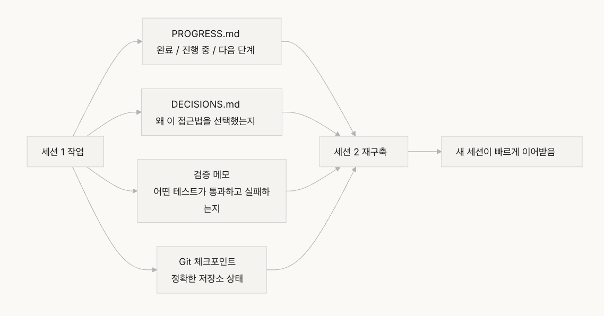

## 강의 04. 명령 파일을 여러 파일로 분산하라

“거대한 명령 파일“ 함정

1. 컨텍스트 예산이 잠식
   1. 혹시 몰라서 챙긴 물건들로 컨텍스트 예산이 이미 빠듯
2. 중간에 길을 잃기
   1. 텍스트의 중간에 있는 정보를 처음과 끝 정보보다 덜 효과적으로 활용
3. 우선순위 충돌
   1. 협상 불가능한 하드 제약, 중요한 설계 지힘, 특정 역사적 교훈이 뒤섞이면
   2. 중요도는 다르지만 파일 안에서 동일하다
   3. 이를 구별할 신뢰할 만한 신호가 필요하다
4. 유지보수 붕괴 = 소프트웨어의 기술 부채 축적
   1. 오래된 명령은 삭제의 결과가 불확실하기 때문에 삭제되지 않는다
   2. 새 명령을 추가하는 것은 공짜처럼 느껴지지만
   3. 결과적으로 파일은 오로지 커지기만 하고 줄어들지 않으며, 신호 대 잡음비는 지속적으로 하락한다
5. 모순이 쌓인다
   1. 서로 다른 시점에 추가된 명령들이 충돌
   2. 에이전트는 매번 하나를 임의로 골라 따른다
      1. 엄마: 따뜻하게 입어라
      2. 아빠: 너무 두껍게 입지 마라

- 핵심 개념
  - 명령 비대화: 명령 파일이 컨텍스트 윈도의 10~15%를 초과 시, 읽기와 작업 추론에 쓸 예산은 잠식
    - 600줄짜리 `AGENTS.md`는 10,000~20,000 토큰을 소비 = 에이전트가 시작 전에 128k 윈도의 8~15%가 소진되는 것
  - 중간 손실 효과: 600줄 파일의 300번쨰 줄에 묻힌 중요한 제약은 사실상 무시된다
  - 명령 신호 대 잡음비: 파일 안의 명형 중 현재 작업과 관련된 비율
  - 라우팅 파일: 에이전트를 더 상세한 문서로 안내하는 것이 핵심 기능인 짧은 집입 파일 (50~200줄)
  - 점진적 공개: 개요 정보 제공 → 필요할 때 상세 정보 제공
    - 좋은 하네스 설계 = 좋은 UI 설계
    - 모든 옵션을 한 번에 사용자에게 쏟아붓지 않는다
  - 우선순위 모호성
    - 모든 명령이 같은 형식과 위치이면, 에이전틑 하드 제약과 소프트 가이드라인을 구별 불가

- 분산하는 방법
  - 핵심 원칙: 자주 필요한 정보는 손이 닿는 곳, 가끔 필요한 정보는 치우고, 결코 쓰지 않을 정보는 버린다
  - `AGENTS.md`:50~200줄로 유지, 자주 사용하는 항목 (프로젝트 개요(한 두 문장), 첫 실행 명령(`make setup & make test`), 전역 하드 제약(협상 불가능한 규칙 최대 15개), 주제 문서 링크(한 줄 설명 + 적용 조건))

    ```md
    # AGENTS.md

    ## 프로젝트 개요

    Python 3.11 FastAPI 백엔드, PostgreSQL 15 데이터베이스.

    ## 빠른 시작

    - 설치: `make setup`
    - 테스트: `make test`
    - 전체 검증: `make check`

    ## 하드 제약

    - 모든 API는 OAuth 2.0 인증을 사용해야 함
    - 모든 데이터베이스 쿼리는 SQLAlchemy 2.0 문법을 사용해야 함
    - 모든 PR은 pytest + mypy --strict + ruff check를 통과해야 함

    ## 주제 문서

    - API 설계 패턴 (`docs/api-patterns.md`) — 엔드포인트 추가 시 필독
    - 데이터베이스 규칙 (`docs/database-rules.md`) — 데이터베이스 작업 수정 시 필독
    - 테스트 표준 (`docs/testing-standards.md`) — 테스트 작성 시 참조
    ```

    - 각 주제 문서: 50~150줄, `docs/` 디렉터리 또는 해당 모듈 옆에 주제별로 정리, 에이전트는 필요할 때만 읽는다
    - 일부 정보: 코드 안에 직접 배치하는 것이 낫다. 타입 정의, 인터페이스 주석, 설정 파일의 설명, 에어전트가 코드를 읽을 때 자연스럽게 이것들을 보게 하여 명령 파일에 중복하지 않게 한다

  - 모든 명령에 출처(”규칙 왜 추가?”), 적용 조건(”규칙 언제 필요?”), 만료 조건(”어떤 상황에서 규칙 제거?”) 세가지가 있어야 한다
  - 장기적으로 감사, 오래된, 중복된, 모순된 항목 제거 = 코드 의존성을 관리하듯 명령을 관리
  - 명령이 반드시 진입 파일에 있어야 한다, 주제 문서로 옮겨 필요할 때만 로드한다

- 실제 사례

  한 SaaS 팀, “여행 가방 재정리”

1. `AGENTS.md`
2. 주제 문서 생성
   1. `docs/api-patterns.md`, `docs/database-rules.md` , `docs/testing-standards.md`

## 강의 05. 세션을 넘어 컨텍스트를 살아있게 유지하라

- 장기 작업에서 ai 코딩 에이전트가 처한 딜레마
  - 매일 아침 일어나면 모든 것을 잊어버리는 장인
  - 일일 일지(연속성 산출물)를 갖춘 장인이 되다
- 컨텍스트 윈도는 유한
  - 코드 베이스 이해, 결정 이력 추적, 도구 출력 처리, 대화 컨텍스트 유지
  - 에이전트가 생성하는 정보가 균등하지 않다
  - 최종 출력에는 “무엇”만 담겨 있다
  - 컴팩션 전략은 보통 후자를 보존하지만 전자를 잃는다
  - 다음 세션은 왜 그렇게 작성됐는지 알지 못하며, 의도적인 설계 결정을 최적화할 수도 있다




- 핵심 개념
  - 컨텍스트 윈도는 유한
    - 소진 후에는 컴팩션 또는 리셋이 필요
  - 컴팩션: 동일 세션 내에서 초기 대화를 요약(”무엇”은 있지만 “왜”는 잃을 수 있음)
  - 리셋: 새 세션을 열어 영속화된 상태에서 재구축(깔끔하지만 산출물 완전성에 의존)
  - 연속성 산출물
    - 새 세션이 이전 세션이 중단한 곳에서 명확히 재개할 수 있도록 해주는 영속화된 상태
    - 기본 형태: 진행 로그 + 검증 기록 + 다음 행동
  - 드리프트
    - 에이전트의 이해와 코드 저장소의 실제 상태 사이의 간극

- 연속성
  1. 중복 작업
     - 건설 현장
       - 두 팀이 동시에 같은 벽을 지을 수 없다
       - 진행기록이 없으면 누군가가 이미 그것을 하고 있는지 모른다
  2. 여러 세션
     - 각 세션은 프로젝트 목표에 대해 다른 이해 (소문 같이 퍼짐)
  3. 검증 격차
     - 이전 세션의 검증 결과가 기록되지 않음
     - 현재 상태를 이해하기 위해 모든 검증을 다시 실행

→ 운영기록

- 모든 작업의 결과가 추적 가능한 상태

ex) Anthropic 장기 실행 에이전트 문서는 “핸드오프 파일”을 명시적으로 권장

핸드오프 파일: 현재 상태, 알려진 이슈, 다음 행동을 담은 구조화 문서

- 건망증 일지
  - 퇴근 전에 교대 에이전트

1. PROGRESS.md

```md
# 프로젝트 진행 상황

## 현재 상태

- 최신 커밋: abc1234 (feat: add user preferences endpoint)
- 테스트 상태: 42/43 통과 (test_pagination_edge_case 실패)
- 린트: 통과

## 완료된 항목

- [x] 사용자 모델 및 데이터베이스 마이그레이션
- [x] 기본 CRUD 엔드포인트
- [x] 인증 미들웨어 통합

## 진행 중

- [ ] 페이지네이션 기능 (90% - 엣지 케이스 테스트 실패 중)

## 알려진 이슈

- test_pagination_edge_case가 빈 결과 세트에서 500을 반환함
- 삭제된 사용자가 목록에 표시돼야 하는지 확인 필요

## 다음 단계

1. 페이지네이션 엣지 케이스 버그 수정
2. "삭제된 사용자 포함" 쿼리 매개변수 추가
3. API 문서 업데이트
```

1. DECISIONS.md
   1. “어떤 결정, 왜, 언제”

```md
# 설계 결정

## 2024-01-15: 사용자 선호도 캐싱에 Redis 사용

- 이유: 읽기 빈도 높음 (모든 API 호출), 데이터 크기 작음
- 거부된 대안: PostgreSQL 구체화 뷰 (변경 빈도가 높아 유지보수 비용이 수지에 맞지 않음)
- 제약: 캐시 TTL 5분, 쓰기 시 능동적 무효화
```

1. git 커밋을 체크포인트로
   1. 각 원자적 작업 단위 완료 후 커밋
   2. 커밋 m: 무엇, 왜 했는지 설명
   3. 무료 자동으로 버전이 관리되는 상태 스냅샷
2. AGENTS.md
   1. init.sh or 하네스 초기화 흐름
   2. 출근과 퇴근 루틴을 명시

   ```md
   ## 세션 시작 시 (출근)

   1. PROGRESS.md를 읽어 현재 상태 파악
   2. DECISIONS.md를 읽어 중요 결정 파악
   3. make check를 실행해 저장소가 일관된 상태인지 확인
   4. PROGRESS.md의 "다음 단계" 섹션에서 이어서 진행

   ## 세션 종료 전 (퇴근)

   1. PROGRESS.md 업데이트
   2. make check를 실행해 일관된 상태 확인
   3. 완료된 모든 작업 커밋
   ```

혼합 전략: 짧은 작업은 한 세션 내에서 완료,

긴 작업은 연속성을 위해 진행 파일과 결정 로그 사용

결정 기준: 작업에 윈도의 60% 이상이 필요하다면 핸드오프 준비 시작

- 컨텍스트 불안
  - 컴팩션
    - 같은 세션 내에서 초기 대화 요약
    - 장점: 연속성 유지, 에이전트가 “무엇”을 볼 수 있다
    - 단점: “왜”는 요약에서 사라짐
  - 컨텍스트 리셋
    - 새 세션을 열고, 영속화된 산출물에서 재구축
    - 장점: 새 세션에는 “시간이 촉박하다”는 불안이 없다
    - 단점: 핸드오프 산출물의 완전성에 의존

  ex) 컴팩션+컨텍스트 리셋 = 하네스 설계의 중요한 구성 요소

  opus 이후로 컴팩션으로만 컨텍스트를 관리

  의미하는 바: 하네스 설계는 대상 모델에 대한 구체적인 이해가 필요하며, 일률적인 템플렛이 아니다

- 핵심 정리
  - 에이전트를 건망증 있는 엔지니어 취급
  - 재구축 비용이 핵심 지표
    - 좋은 하네스는 새 세션이 3분 이내에 실행 가능한 상태에 도달하도록 한다

- 핸드오프 템플릿 설계
  - 네 개의 필드를 가진 최소 핸드오프
    - 저장소 상태(커밋 해시), 실행 상태(테스트 통과율), 차단 항목, 다음 행동
    - 새로운 에이전트 세션이 템플릿만을 이용해 프로젝트 상태를 복원하게 한다
    - 복원 중 만난 모호함을 기록하고 템플릿을 개선한다

## 강의06. 모든 에이전트 세션 전에 초기화

## 왜 초기화가 먼저여야 하는가

새로운 에이전트 세션에서 곧바로 기능 구현을 시작하면 처음에는 빠르게 진행되는 것처럼 보인다.

하지만 구현을 진행하는 도중

- 테스트 프레임워크가 제대로 설정되지 않았음을 발견하고,
- 프로젝트 구조를 다시 이해해야 하고,
- 환경 설정과 인프라를 뒤늦게 수정하게 된다.

결국 대부분의 시간은 **기능 개발이 아니라 프로젝트를 다시 이해하는 데** 소비된다.

> **기초를 다지지 않은 채 벽부터 세우는 것과 같다.**
>
> 기초가 굳기 전에 벽을 올리면 결국 다시 허물고 처음부터 시작해야 한다.

---

# 초기화와 구현은 서로 다른 단계다

초기화와 구현은 **최적화 목표 자체가 다르다.**

### 구현 단계의 목표

- 검증된 기능의 수량과 품질 극대화

### 초기화 단계의 목표

- 이후 모든 구현의 신뢰성과 효율성 극대화

둘을 한 세션에서 함께 수행하면 에이전트는

- 인프라도 구축하고
- 기능 코드도 작성해야 하는

**다중 목표 최적화 문제**를 해결해야 한다.

그 결과 눈에 보이는 코드 작성에 집중하게 되고,
프로젝트의 기반이 되는 인프라는 쉽게 희생된다.

---


# 초기화와 구현을 섞으면 생기는 문제

## 1. 부실한 기반

에이전트는 기능 구현에 대부분의 시간을 사용하고,
인프라는 최소한으로만 구축한다.

그 결과

- 테스트는 존재하지만 검증되지 않았고
- 린트는 설정되었지만 충분하지 않고
- 프로젝트 진행 정보도 남지 않는다.

이 문제는 첫 번째 세션에서는 잘 드러나지 않는다.

하지만 **두 번째 세션부터 프로젝트를 다시 이해하는 비용**이 발생한다.

---

## 2. 미검증 코드가 누적된다

테스트 환경보다 기능 구현이 먼저 이루어지면

모든 코드는 **검증되지 않은 상태**로 쌓인다.

나중에 테스트를 추가하려고 하면

- 설계가 잘못되었음을 발견하고
- 이미 작성한 코드를 다시 수정해야 한다.

이는 굳지 않은 콘크리트 위에 타일을 붙이는 것과 같다.

---

## 3. 암묵적인 가정이 사라진다

초기화 과정에서 내린 결정

- 테스트 프레임워크
- 디렉터리 구조
- 의존성 관리 방식

등이 문서화되지 않으면

새로운 에이전트 세션은 그 선택을 알 수 없다.

결국 프로젝트마다 서로 다른 기준으로 작업하게 되고,
기초 자체가 흔들리게 된다.

---

# 초기화 단계의 핵심 개념

## Initialization Phase

초기화는 **기능을 만드는 단계가 아니다.**

이후 모든 구현이 안정적으로 진행될 수 있도록
프로젝트의 기반을 만드는 단계이다.

> 초기화의 출력은 **코드가 아니라 인프라**이다.

---

## Bootstrap Contract

새로운 에이전트가 저장소만 보고도

- 프로젝트를 시작할 수 있고
- 테스트할 수 있고
- 현재 진행 상황을 이해할 수 있고
- 다음 작업을 바로 이어갈 수 있어야 한다.

이 네 가지 조건을 만족하는 것이 부트스트랩 계약이다.

---

## Cold Start vs Warm Start

### Cold Start

- 빈 프로젝트에서 시작
- 구조와 규칙을 모두 추론해야 함

### Warm Start

- 이미 인프라가 구축된 템플릿에서 시작
- 바로 기능 개발 가능

> Warm Start가 훨씬 효율적이다.

---

## Handoff Readiness

어느 시점에서든 새로운 에이전트가

별도의 설명 없이

저장소만으로 작업을 이어갈 수 있는 상태를 의미한다.

---

# 올바른 초기화 방법

## 1. 첫 번째 세션은 초기화만 수행한다.

비즈니스 기능은 구현하지 않는다.

초기화에서 만들어야 하는 것은 다음과 같다.

### 실행 가능한 환경

- 프로젝트 실행 가능
- 의존성 설치 완료
- 환경 오류 없음

---

### 검증 가능한 테스트 환경

최소 하나의 테스트가 통과해야 한다.

이는

> 테스트 환경 자체가 올바르게 구축되었다는 증거이다.

---

### Bootstrap Contract 문서

반드시 포함해야 할 내용

- 프로젝트 실행 방법
- 테스트 방법
- 현재 상태
- 프로젝트 구조

```md
# 초기화 계약

## 시작 명령

- 의존성 설치: `make setup`
- 개발 서버 시작: `make dev`
- 테스트 실행: `make test`
- 전체 검증: `make check`

## 현재 상태

- 모든 의존성 설치 및 잠금
- 테스트 프레임워크 설정됨 (Vitest + React Testing Library)
- 예제 테스트 통과 (1/1)
- 린트 규칙 설정됨 (ESLint + Prettier)

## 프로젝트 구조

- src/ — 소스 코드
- src/components/ — React 컴포넌트
- src/api/ — API 클라이언트
- tests/ — 테스트 파일
```

---

### 작업 분해

전체 프로젝트를

순서가 있는 작업 목록으로 나누고

각 작업마다 명확한 완료 조건을 정의한다.

```md
# 작업 분해

## 작업 1: 사용자 인증 기본

- JWT 인증 미들웨어 구현
- 로그인/회원가입 엔드포인트 추가
- 인수 기준: pytest tests/test_auth.py 모두 통과

## 작업 2: 사용자 프로필 페이지

- 사용자 프로필 CRUD 구현
- 프로필 편집 폼 추가
- 인수 기준: pytest tests/test_profile.py 모두 통과

## 작업 3: 검색 기능

- ...
```

---

### Git 체크포인트

초기화가 끝나면

깨끗한 상태를 Git에 커밋한다.

이후 모든 작업은 이 체크포인트부터 시작한다.

---

# 초기화 완료 기준

초기화는

**얼마나 많은 기능을 만들었는가**가 아니라

Bootstrap Contract의 네 가지 조건을 만족하는지가 기준이다.

- 프로젝트를 시작할 수 있는가
- 테스트를 실행할 수 있는가
- 현재 진행 상황을 확인할 수 있는가
- 다음 작업을 바로 이어갈 수 있는가

```md
## 초기화 인수 체크리스트

- [ ] `make setup`이 처음부터 성공함
- [ ] `make test`에 최소한 하나의 통과하는 테스트가 있음
- [ ] 새 에이전트 세션이 저장소 내용만으로 "실행 방법"과 "테스트 방법"을 답할 수 있음
- [ ] 최소 3개의 작업이 있는 작업 분해 파일이 존재함
- [ ] 모든 것이 git에 커밋됨
```

---

# 사례 비교

## 초기화와 구현을 함께 진행

세션 1

- 스캐폴딩
- 첫 기능 구현

하지만

- 시작 문서 없음
- 테스트 기준 없음
- 작업 목록 없음

세션 2에서는

프로젝트 구조와 테스트 환경을 다시 파악하는 데 많은 시간을 사용한다.

---

## 초기화를 먼저 수행

세션 1에서는

- 프로젝트 구조 구축
- 테스트 프레임워크 설정
- 예제 테스트 검증
- Bootstrap Contract 작성
- 작업 분해
- Git 체크포인트 생성

만 수행한다.

그 결과

세션 2에서는 프로젝트를 다시 이해할 필요 없이

곧바로 작업 목록에서 다음 기능을 구현할 수 있다.

---

# 핵심 정리

- 초기화와 구현은 목적이 다르므로 반드시 분리한다.
- 기초를 먼저 만들고 기능을 구현한다.
- 초기화의 결과물은 코드가 아니라 인프라이다.
- Bootstrap Contract를 통해 새로운 에이전트도 저장소만으로 작업을 이어갈 수 있어야 한다.
- 실행 환경, 테스트 환경, 프로젝트 구조, 작업 분해를 먼저 완성한다.
- 초기화에 투자한 시간은 이후 여러 세션에서 반복적으로 회수된다.
- **견고한 기초일수록 이후 구현 속도는 더 빨라진다.**

---

# 실습 과제

강의에서 배운 내용을 실제 프로젝트에 적용하기 위한 연습 문제이다.

## 1. Bootstrap Contract 작성

현재 개발 중인 프로젝트를 대상으로 **완전한 Bootstrap Contract**를 작성한다.

그 후 새로운 에이전트 세션을 열어

- 저장소만 제공한다.
- 구두 설명은 하지 않는다.
- 프로젝트를 실행한다.
- 테스트를 수행한다.
- 현재 진행 상황을 파악한다.

이 과정에서 발생하는 모든 문제를 기록한다.

> 발생한 문제는 Bootstrap Contract에서 빠진 정보이며,
> 이후 계약 문서에 반드시 추가해야 할 항목이다.

---

## 2. 초기화 전략 비교 실험

동일한 프로젝트를 두 가지 방식으로 진행해 본다.

### 방법 A: 초기화 + 구현 동시 진행

첫 번째 세션에서

- 프로젝트 초기화
- 첫 번째 기능 구현

을 함께 수행한다.

### 방법 B: 초기화 전용 세션

세션 1

- 초기화만 수행

세션 2

- 기능 구현 시작

---

### 4개 세션 이후 비교

다음 항목을 비교한다.

- 첫 번째 검증(Test Pass)까지 걸린 시간
- 새로운 세션의 재구축 비용
- 기능 완료율
- 프로젝트 이해 시간
- 전체 개발 효율

이를 통해 **초기화에 투자한 시간이 실제로 얼마나 회수되는지** 확인한다.

---

## 3. 초기화 인수 체크리스트 만들기

프로젝트만의 Initialization Checklist를 직접 설계한다.

새로운 에이전트 세션이

체크리스트를 처음부터 수행하도록 한 뒤

각 항목을

- 통과(Pass)
- 실패(Fail)

로 기록한다.

실패한 항목은

> 프로젝트의 하네스(Harness)가 부족한 부분이며,
> Bootstrap Contract 또는 초기화 단계에서 반드시 보완해야 한다.
