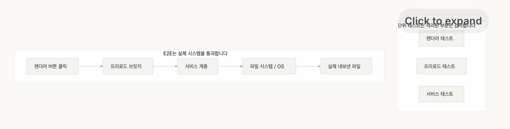

# 강의 10. 엔드투엔드 테스트(E2E)만이 진정한 검증이다

## 왜 단위 테스트만으로는 부족한가

단위 테스트(Unit Test)는 각 컴포넌트가 **개별적으로 올바르게 동작하는지** 확인한다.

하지만 실제 시스템은 여러 컴포넌트가 함께 동작한다.

각 부분이 모두 정상이어도

> **컴포넌트 간 경계(Component Boundary)** 에서 발생하는 문제는 단위 테스트가 발견하지 못한다.

엔드투엔드 테스트(E2E)는 이러한 **시스템 수준의 결함**을 검증하는 유일한 방법이다.

---

# 단위 테스트의 맹점

단위 테스트는 **격리(Isolation)** 를 전제로 한다.

하지만 실제 환경에서는 다음과 같은 문제가 발생한다.

### 인터페이스 불일치

각 컴포넌트는 올바르게 동작하지만

컴포넌트 간 인터페이스가 맞지 않아 전체 시스템이 실패한다.

---

### 상태 전파 오류

각 계층은 정상이어도

상태(State)가 다른 계층으로 올바르게 전달되지 않을 수 있다.

---

### 리소스 수명 주기 문제

실제 환경에서는

- 파일 핸들
- 데이터베이스 연결
- 네트워크 소켓

등의 자원이 여러 컴포넌트를 거치며 관리된다.

단위 테스트는 이러한 자원 관리 문제를 발견하기 어렵다.

---

### 환경 의존성

모의(Mock) 환경에서는 정상이어도

실제 실행 환경에서는

- 설정 차이
- 네트워크
- 서비스 상태

등으로 인해 실패할 수 있다.

---

# 엔드투엔드 테스트가 만드는 변화

엔드투엔드 테스트는 단순히 **결함을 찾는 도구가 아니다.**

개발자의 구현 방식 자체를 바꾼다.

### 1. 컴포넌트 간 상호작용을 먼저 고려한다.

단순히 함수 하나를 구현하는 것이 아니라

> "이 인터페이스가 다른 컴포넌트와 어떻게 연결되는가"

를 먼저 생각하게 된다.

---

### 2. 아키텍처 규칙을 자연스럽게 지키게 된다.

엔드투엔드 테스트는

아키텍처 제약을 실제 실행 과정에서 검증한다.

따라서 구조를 무시한 구현은 자연스럽게 실패한다.

---

### 3. 오류 처리를 적극적으로 설계한다.

실패 시나리오까지 포함하여 테스트하기 때문에

예외 처리와 복구 로직을 처음부터 고려하게 된다.

---

# 테스팅 피라미드


# 리뷰 피드백 승격



---

# 테스트는 리뷰보다 강력한 피드백이다

에이전트를 위한 리뷰는

단순한 문장이 아니라

**자동으로 실행되는 검증**이어야 한다.

예를 들어

> "Renderer에서 직접 파일 시스템 접근 금지"

라고 적는 것이 아니라

이를 자동으로 검사하는 테스트를 만들어야 한다.

문서를 읽는 것보다

실패하는 테스트가 훨씬 강력한 피드백이 된다.

---

# 핵심 개념

## 컴포넌트 경계 결함

단위 테스트는 통과하지만

컴포넌트 사이의 상호작용 때문에 발생하는 결함.

---

## 테스트 적합성 기울기

결함을 발견하는 능력은

단위 테스트 → 통합 테스트 → 엔드투엔드 테스트

순으로 증가한다.

---

## 아키텍처 경계 강제

아키텍처 규칙은

문서가 아니라

자동으로 실행되는 검사로 강제해야 한다.

---

## 리뷰 피드백 승격

반복해서 지적되는 리뷰 내용은

자동 테스트로 승격시켜

다음부터는 사람이 아니라 시스템이 검증하도록 만든다.

---

## 에이전트 지향 오류 메시지

오류 메시지는

단순히 무엇이 틀렸는지를 알려주는 것이 아니라

- 무엇이 잘못되었는지
- 왜 잘못되었는지
- 어떻게 수정해야 하는지

까지 포함해야 한다.

---

# 어떻게 해야 하는가

## 1. 아키텍처를 먼저 정의한다.

엔드투엔드 테스트보다 먼저

시스템의 아키텍처 경계를 명확히 정의한다.

OpenAI는

Layered Domain Architecture를 권장한다.

```
Types
→ Config
→ Repository
→ Service
→ Runtime
→ UI
```

의존성은 한 방향으로만 흐르도록 설계한다.

---

## 2. 하네스에 엔드투엔드 계층을 포함한다.

검증 단계는 명확하게 나눈다.

- Level 1 : 단위 테스트
- Level 2 : 통합 테스트
- Level 3 : 엔드투엔드 테스트

특히 **컴포넌트 경계를 변경하는 작업은 E2E 테스트 통과가 완료 조건**이다.

---

## 3. 아키텍처 규칙을 자동 검사로 만든다.

아키텍처 규칙은

문서가 아니라

실행 가능한 검사(Test 또는 Lint Rule)로 구현해야 한다.

---

## 4. 에이전트 지향 오류 메시지를 만든다.

좋은 오류 메시지는 항상

- ERROR
- WHY
- FIX

세 가지 정보를 포함한다.

즉,

> 무엇이 문제인지,
> 왜 문제인지,
> 어떻게 해결하는지를 모두 알려줘야 한다.

---

## 5. 리뷰 피드백을 자동화한다.

반복되는 코드 리뷰는

자동 검사로 승격시킨다.

새로운 유형의 오류가 발견될 때마다

하네스가 점점 더 강력해진다.

---

# 실제 사례

Electron 파일 내보내기 기능에서는

각 컴포넌트의 단위 테스트는 모두 통과했다.

하지만 엔드투엔드 테스트에서는

- 인터페이스 불일치
- 상태 전파 오류
- 리소스 누수
- 권한 문제
- 오류 전파 실패

등 **5개의 결함**을 발견했다.

단위 테스트는 하나도 발견하지 못했다.

테스트 시간은 늘어났지만

전체 시스템의 신뢰성은 크게 향상되었다.

---

# 핵심 정리

- 단위 테스트는 **컴포넌트 경계 결함**을 발견하지 못한다.
- 엔드투엔드 테스트는 **결함뿐 아니라 개발자의 구현 방식까지 바꾼다.**
- 아키텍처 규칙은 문서가 아니라 **자동으로 실행되는 검사**여야 한다.
- 오류 메시지는 **무엇이 문제인지 + 왜 문제인지 + 어떻게 수정하는지**를 포함해야 한다.
- 반복되는 리뷰는 **자동 테스트로 승격**하여 하네스를 지속적으로 강화한다.
